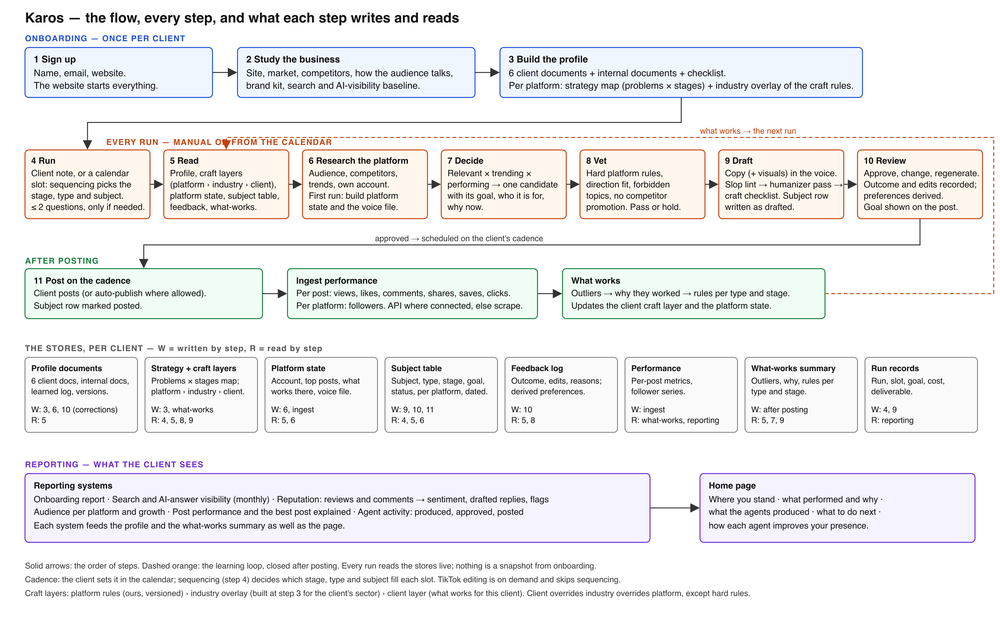

# Karos craft layer

For Tomer and Shlomi. What we add to the flow, why, what the research found, and what to build. One file per platform sits next to this one with the rules to integrate. Everything here is a proposal until Albert approves; then the learning-loop document is updated to match.

## 1. What this adds

1. **A craft layer**: three levels of rules every run reads. Platform rules (ours), an industry overlay (per client sector), a client layer (what works for this client).
2. **A quality gate in drafting**: slop lint → humanizer pass → detector score as a signal → craft checklist.
3. **A strategy document per client per platform**, built at setup, read at every run, updated by feedback and performance.
4. **A question budget**: zero questions by default, at most two per run, only when a gap blocks quality. Calendar runs never ask.
5. **The flow mapped**, every step with what it writes and reads (§8).

---

## 2. How best practices plug into the loop

**The question:** do best practices depend on the client's sector? Yes, but in a bounded way. The research pages (§8 of each) show which rules vary by industry: proof types, compliance and claims, tone, format mix, timing, hashtag and mention tolerance, visual style. Everything else (anatomy, hooks, platform mechanics, hard limits) is platform-level. So the sector layer is a small overlay of 10 to 20 rules, not a second rulebook, and the client's own results are the third and strongest layer.

| Layer | What it holds | Who writes it | When it changes | Where a run uses it |
|---|---|---|---|---|
| **L1 Platform craft** | The platform pages in this folder: hard rules (limits, policies, dimensions) and defaults (anatomy, hooks, formats by stage, timing, checklist) | Us. Versioned, one file per platform | When the platform changes; quarterly review; when performance across clients contradicts a rule | Step 5 read; step 8 vet (hard rules); step 9 draft (defaults as instructions + the checklist) |
| **L2 Industry overlay** | The rules that differ for this client's sector: proof, compliance, tone, formats, timing, mention tolerance, visual style | Built at step 3 from the client's category, the platform pages' industry tables, and research on the sector's top accounts | Monthly refresh; later learned across clients in the same sector | Step 5 read; step 7 decide (what is relevant); step 8 vet (compliance); step 9 draft |
| **L3 Client layer** | What works for this client: the what-works summary, derived preferences (never-topics, likes, voice lessons), the account's own top posts | Written at step 10 (review) and after posting (ingestion) | Every ingestion; every review | Step 5 read; step 7 decide (what performs); step 9 draft (voice, formats that won) |

Precedence: L3 overrides L2 overrides L1 defaults. L1 hard rules always win. A conflict is logged with the rule ids, so a rule that keeps losing to performance gets reviewed.

The full system (the sector map with 16 sectors, how the client layer is built from evidence, the monthly and quarterly improvement loops, and how engagement is measured per platform and per rule) is in `11-best-practices-as-a-system.md`.

**Rule format**, so the agent can cite the rule it applied and the loop can test it: `id · layer · platform · hard|default · the rule · why · source · date · what to measure`. The platform pages are written to be turned into this table.

**Step by step:**
- Step 3 builds L2 per platform and the strategy map (§6).
- Step 5 hands the run L1 + L2 + L3 for that platform, alongside the profile, platform state, subject table and feedback.
- Step 6 research is scoped by L1's "what to research" (accounts the audience follows, trend sources per platform) and refreshes L3 evidence (the account's top posts).
- Step 7 decide uses L1/L2 "formats by funnel stage" and L3 "what performs" to pick the candidate and its goal.
- Step 8 vet checks L1 hard rules, L2 compliance, forbidden topics and competitor mentions. Pass or hold with the rule id.
- Step 9 draft takes L1/L2 defaults as instructions in the voice, then runs the quality gate (§5) and the page's checklist. Visual rules for Instagram and TikTok are in the same pages.
- Step 10 records outcome and edits into L3 preferences; an edit is a voice lesson.
- After posting, ingestion updates L3 (what-works) and the platform state; a monthly job proposes L2 changes and flags L1 rules that performance contradicts.

---

## 3. Flow audit: what changes against the loop as documented on 2026-09-15

| Step | As documented | Change | Why |
|---|---|---|---|
| 3 Profile | Six documents + internal docs + checklist | Add per platform: the strategy map and the L2 overlay | The agent had no rules to draft by and no map to pick from |
| 4 Run | Note or calendar slot; sequencing picks stage, type, subject | Add the question budget (§4); sequencing also reads L3 | Fewer inputs, no static forms; slots follow what performs |
| 5 Read | Profile, platform state, subject table, feedback, what-works | Add L1, L2, L3 | The craft layer must reach the run |
| 6 Research | Platform-specific; first run builds platform state | Scope research by the platform page; refresh top-post evidence every run | Research was undirected |
| 7 Decide | Relevant × trending × performing | Use formats-by-stage (L1/L2) and what-works (L3) | Makes "performing" concrete |
| 8 Vet | Direction, forbidden topics, competitor | Add L1 hard rules and L2 compliance, with rule ids | Vetting had no platform rules |
| 9 Draft | Copy + visuals | Add the quality gate and the checklist | No quality control existed |
| 10 Review | Outcome recorded | Derive preferences; diff edits as voice lessons | Feedback never became rules |
| After posting | Ingest, what-works | What-works updates L3; monthly job proposes L2 edits | Closes the loop across layers |

Two structural points the audit adds:
- **Platform state and the client layer stay separate.** Platform state is facts about the account (size, history, top posts). L3 is rules derived from facts. Mixing them made "what works" unqueryable.
- **Hard rules are vetting, defaults are drafting.** A hard rule (a limit, a policy, a compliance line) must hold a post; a default (a length, a hook pattern) should shape it and may be overridden by L3. The pages mark every rule as one or the other.

---

## 4. Inputs: minimal, and dynamic questions

- **Default: zero questions.** One box for a note, and Run. Options (kind of post, number of posts, identity) move behind "more" or are decided by sequencing.
- **Budget: at most two questions per run**, only when a gap blocks quality. Triggers: a format needs an asset the client has not supplied; identity is ambiguous (which person posts); a fact only the client holds (a date, a number, a name, a customer's consent); a compliance question; two equally strong candidates where the client's preference matters (the topic-first choice on a manual Instagram run).
- **Mechanics:** the run pauses at a gate showing one question, a proposed default, and "decide for me". Calendar runs never ask: autopilot takes the default and flags it in the review note. Unanswered after a timeout → the default. Questions are generated from the run context, never from a form.
- **Standing intake stays small:** handle or account, who posts, off-limits, disclosure wording. Everything editorial is built, never asked (already the rule in every contract).

---

## 5. Humanizer and anti-slop: what we integrate

**Recommendation: Rephrasy API** first, behind a per-client flag, default off. Why: a markdown mode that rewrites text nodes and leaves links, hashtags and CTAs intact; a per-client Writing Style ID trained on the client's own sentences (brand voice, not a tone preset); a readability score in the response; flat per-call pricing suited to 100-word posts; EU jurisdiction, deletion on request. Weaknesses: small vendor, unnamed third-party models, self-reported quality, and detector evasion is a moving target (its own changelog: 34% → 67% → "9 of 10" on GPTZero across v2 to v4). **Runner-up: WriteHuman** (documented REST, seven tones, French, per-sentence detect endpoint; about 20 s latency, no voice cloning). StealthGPT is cheapest but its tone control is academic. Avoid Undetectable.ai (perpetual licence over submitted content, about $1 per 1k words). Twixify and Grammarly have no API. Full comparison in `09-humanizer-tools.md`.

**The honest finding.** No independent benchmark measures meaning preservation or brand-voice fidelity for any humanizer. Academic work shows paraphrase humanization drifts meaning while the machine fingerprint stays, and the strongest detector still flags 97.67% of humanized output (Pangram 4, July 2026). A humanizer buys months, not a capability. The primary lever is the style spec plus 5 to 10 of the client's own posts plus a negative list, then a deterministic slop lint with one model revision pass on hits. No French tell list exists in the open-source linters; we author one.

**Detectors: a signal, never a gate.** False positives run 7% (Originality) to 17% (Sapling) on a 2,400-sample benchmark; short copy is where every detector is weakest; they penalise non-native and plain English, which matters for French clients. Telemetry only: Sapling per post (about $0.005), Pangram or Originality on a monthly 5% sample; stored on the job, alert on client-level trends.

**Model choice.** Evidence contradicts across detectors (Pangram finds Claude the easiest family to detect, Winston the hardest). Keep the Anthropic models already wired in; spend the effort on the prompt; A/B with a rubric before any switch.

**Cost per 150-word post**, on top of the draft: about $0.02 to $0.06 (Rephrasy $0.015 to $0.05, Sapling $0.005, lint $0). **Top risk:** fact and voice drift from the paraphraser. Mitigation: a hard retention diff (every number, name, URL, price and date must survive), an embedding-similarity floor that fails closed to the lint-only text, and the blind test below.

**Pipeline in step 9:** draft in the voice with L1/L2 defaults → **slop lint** (deterministic: the no-AI-tells lists from the platform pages plus the Wikipedia signs-of-AI-writing patterns; em dashes, rule-of-three closers, "great question", uniform sentence length, stock openers) → **humanizer pass** through the chosen API with keep-terms (brand names, numbers, quotes) and the voice card as constraints → **detector score** logged as a signal, never a gate → re-lint → the platform checklist → deliver. Every pass logs before/after so the loop can measure fact drift and voice drift.

**Test before rollout:** per pilot client, 50 published posts of the client's own as the control; four arms on 50 fresh briefs: A raw draft, B draft + lint + model revision, C = B + Rephrasy with the client's style, D = B + StealthGPT. Three blind raters (the client plus two staff) answer "sounds like us". Automatic: lint hits, entity and number retention (must be 100%), embedding similarity, detector scores as description. Ship C only if it beats B by at least 10 points with no lost facts; if B is within 10 points of the control, ship B and leave the flag off. Repeat quarterly.

---

## 6. Strategy document template

The template (full version with evidence in `10-strategy-template.md`), one document per client per platform, one line of guidance per field:

0. Header: client, platform, seat, version, last changed by what (setup / feedback / performance / review).
1. Audience sheet: role → problem they must solve → what must be true before they act → where they are online for it.
2. Problems ranked: the 3 to 5 problems, ordered by roles sharing it, how directly the product solves it, how loudly the platform discusses it now.
3. Content map: per problem × stage, 3 ideas, each with goal, type, source needed, used-on. This is the topic pool.
4. Voice card summary: what the person sounds like, two phrases they use, two they never use, their stance, the proof they can cite.
5. Distribution plan: who posts per stage, where, first-hour actions, named amplifiers, first-comment rule.
6. Sequencing inputs: cadence from the client's calendar, no-repeat on stage, type and format, subject window per platform, promo at most 1 in 6, timely only on a real anchor, weight to performance.
7. Feedback loop: per post the outcome, original vs final text, the client's reason, the delivered goal, problem, stage, type and why-now; and what each changes (edit → voice card, skip with reason → never-topic, like → weight, outlier → mix).
8. Measures per stage: attention = impressions, new followers, reach beyond followers; expertise = comments, saves, completion, profile visits; decide = link clicks, DMs naming the post, replies from buyer roles.
9. Industry overlay: claims needing a source, off-limits topics, competitors never named, the buyer's calendar, language and region.
10. Review cadence: every run reads 3, 6, 7; monthly rewrites the 6 mix and the 2 rank from 8; quarterly rebuilds 1 and 3 from the refreshed profile.

**The two questions the client is asked at setup**, and nothing else: "Of these problems, which one do your best customers hire you for first?" (confirms the ranking) and "Who posts from their own profile, and who can reply in the first hour?" (fills distribution and the seat). Never ask what the six documents already answer, what to post about, how the funnel works, for metrics they do not have, or anything phrased as review or approval.

**Strongest evidence behind it.** Personal profiles out-reach company pages by 561% and employee advocacy drives 30% of company engagement (van der Blom 2025, 1.8M posts); the first 60 to 90 minutes decide distribution; the same format twice running is suppressed up to 20%; 2 to 3 varied posts a week lift visibility up to 120%; a comment counts twice a like and one save equals five likes (AuthoredUp, 621k posts). On X the open-sourced ranker weights a reply 13.5 and an author-engaged reply 75 against 0.5 for a like.

**Platform adaptations:** X adds the conversation roster (20 to 40 accounts the buyers follow); Reddit's section 1 is the three rings with rules and the date read, and its funnel is the buyer's question; Instagram's map is formats × templates, 3 to 5 series; TikTok is one series per stage; newsletter is pillars × goal per issue; blog is clusters by intent with one pillar and 20 to 30 linked pages.

**Developer fields the template needs:** `stage` on every topic-catalog row and every delivered post; `originalText` and `finalText` on the feedback row (the voice lesson is the diff); `amplifiers[]` and `firstHourOwner` on the client × platform record; `subjectWindowDays` and `promoEveryN` as per-platform settings; a default stage mix of 3 attention : 2 expertise : 1 decide per six posts until performance exists, logged as a default.

**Fit in the flow:** built at step 3 per platform from the six documents; the client sees it if they choose; read at every run (the map is the topic pool, the stage is on every row); updated by review (preferences) and after posting (what-works). Sequencing reads its cadence and no-repeat rules; the goal on every output comes from its map.

---

## 7. The platform pages

One file per platform in this folder. Each has the same eleven sections: sources; what the platform rewards now; post anatomy with numbers; formats ranked by funnel stage; hooks; writing rules; media rules; distribution mechanics; what varies by industry; what to measure; a pre-delivery checklist; and feedback for the developer integrating it. Section 11 of each page is the developer's to-do list for that agent. Sections 1 to 7 become L1 rules; section 8 seeds L2; section 10 is the checklist step 9 runs.

| Platform | Strongest rules (evidence) | Most industry-dependent | Where sources conflict |
|---|---|---|---|
| X | Replies and quotes are the currency (2026 ranker: reply 5.0, quote 5.0, like 0.5, report −234); never trigger negative feedback; text wins (ER 3.56% text vs 2.25% link); Premium tier decides reach (free median <100 impressions, Premium+ >1,550); the first 280 characters are the post | Posting window; proof and claim constraints (regulated); format mix (B2B text and threads, DTC image and polls) | Engagement weights (2023 README vs 2026 file); link penalty (Buffer data vs Musk 2026-07-28 vs no penalty term in the scorer); timing |
| LinkedIn | Dwell time ranks, the "see more" click does not; since 2026-03 the feed is LLM retrieval on author topic history, so one topic lane per identity; person beats page on every dataset; documents lead every format study, text is the safe default; edit within 10 minutes, never add a link after publishing (−42%) | Posting window; proof and media (selfies help stories, hurt expertise posts); FINRA pre-review and retention for finance | External links (−18.8% to +51% depending on dataset and page vs profile); video; post length (800–1,000 vs 1,301–2,500); polls; repost style |
| Reddit | "Best" comment sort is a Wilson lower bound, so early votes move rank most; 60–75% of a thread's upvotes land in the first 90 minutes, reply inside 30 min to 3 h; Reddit threads live in Google and AI answers for 8–14 months, so write a quotable self-contained answer; CQS and karma/age gates filter accounts regardless of content; 68.6% of removals are automated | Subreddit rings and mention tolerance per vertical; finance and legal subs ban vendors outright; agency solicitation is a ban trigger | ChatGPT's Reddit citation share swung 60% → 10% → 0.5% across 2025–2026 while Perplexity holds 24% |
| Instagram | Optimise sends per reach and saves per reach, not likes; carousels get a second serve from slide 2 (slide 2 must work as a cover); 1080×1350 hard, first slide locks the ratio, grid tile 3:4 since Jan 2025; body text ≥32 canvas px and 4.5:1 contrast; hashtags are dead weight, caption and alt-text keywords feed ranking and Google | Format lead flips by sector (carousels in finance, tech, education; Reels in fashion, food, beauty, retail, travel); on-slide disclaimers for regulated; real photos and releases for DTC and hospitality; posting windows | Best time (three studies, three answers); grid ratio 4:5 vs 3:4; "more" truncation 125 vs 150 characters; slide-count sweet spots are vendor claims only |
| TikTok and Reels | Watch time and completion dominate (3.75 s average watch, 4% full-watch on a 41 s video); AI voice or realistic AI visuals must be labelled on both platforms, real-person likeness is prohibited; business accounts may use only the Commercial Music Library and clearance does not carry to Reels; Reels downrank watermarked, low-res or reused video, so clips need added commentary and a clean export; safe zones are published (top 14%, bottom 35%, sides 6%) | Length (TikTok peaks 0–30 s, Reels 45–60 s, reach favours >60 s); engagement benchmarks 0.7% (tech, agencies) to 2.6%; branded-content rules age-gate finance and alcohol and prohibit pharma and political | Posting windows; engagement baselines by denominator; podcast-clip length (15–30 s vs longer wins) |
| Newsletter | Deliverability is a hard gate (SPF, DKIM, aligned DMARC, one-click unsubscribe honoured in 2 days, spam rate <0.30%; Gmail and Outlook reject violators); opens are not an objective after Apple MPP (62% of clients), optimise on clicks, replies, unsubscribes; irregular senders unsubscribe at 0.87% vs 0.38% weekly; 2–5 links click best, single-link converts 37.5% more; legal footer and claims are refuse-not-rewrite | Format and link budget (creator CTR 6.17% vs SaaS 1.67%); compliance pack for finance and health; cadence and tone by sector | Subject length (0–20 vs 20–40 vs 61–70 characters); emoji; send hour; dark-mode share |
| Blog | Rank first, then get cited: AI Overviews use core ranking; quotes (+41%) and statistics (+33%) raise AI citation odds; brand mentions beat backlinks for AI visibility (r=0.66 vs 0.22); freshness matters to LLMs (cited URLs 25.7% newer), not to AI Overviews; expect citations not clicks (top-result CTR −34.5% to −58%), measure citations per engine | How much rank buys (AIO overlap 71–75% B2B and health vs 19–32% local, travel, finance); length and proof by sector; EU AI Act disclosure from 2026-08-02 for public-interest text | Top-10 share of AIO citations (37% vs 54.5% vs 70%, different denominators); word count (Google says none; 2,900+ words 59% more cited); CTR magnitude; FAQ schema (valid, rich result removed 2026-05-07) |
| Landing page | Core Web Vitals are a hard gate (LCP ≤2.5 s, INP ≤200 ms, CLS ≤0.1); write at grade 5–7 (11.1% vs 5.3% "professional"; SaaS 12.9% vs 2.1%); benchmark within the traffic channel (email 19.3%, paid social 12%, paid search 10.9%); consent, fake-review and WCAG 2.2 AA rules are non-negotiable; mobile first and one goal (83% of visits mobile) | Form length (1–2 fields opt-in, 3–5 demo, ≤8 checkout; high-intent pages tolerate 10); proof and compliance in finance; price transparency (hidden cost is the top DTC abandonment reason) | Device lift by industry; attention above the fold (80% vs 57% vs "40%"); form-field optimum |

---

## 8. The flow, mapped

The SVG source is `flow.svg` in this folder.

---

## 9. What to build (delta to the learning-loop scope)

- K1. Craft store: rules in the format above, per platform and layer; loader that turns each platform page into L1 rules.
- K2. L2 builder at step 3: sector detection from the profile, overlay from the pages' industry tables plus sector research; monthly refresh job.
- K3. Craft injection at step 5, with L3 from the what-works summary and derived preferences.
- K4. Vetting with rule ids at step 8; hold reasons shown to staff, never narrated to the client as review.
- K5. Quality gate at step 9: slop lint, humanizer API client, detector client, checklist runner, before/after logging.
- K6. Question gate: trigger detection, one question with a default, timeout, autopilot on calendar runs.
- K7. Strategy document builder at step 3; client visibility switch.
- K8. Monthly craft review job: L2 proposals, L1 contradictions, report to staff.
- K9. Blind test harness for the humanizer (50 posts per client, control = own posts).
- K10. French slop list and per-client brand-term allowlist for the lint; sentence-length variance and rule-of-three counters, which no open-source linter ships.
- K11. X engine: stop sourcing pictures; attach the client's picture only (Albert's ruling).
- K12. Template fields: `stage` on topic rows and posts, `originalText`/`finalText` on feedback, `amplifiers[]` and `firstHourOwner` per client × platform, `subjectWindowDays` and `promoEveryN` per platform.

---

## 10. Decisions

All settled in 05 Decisions log: D29 (the three-layer model), D30 (humanizer), D31 (AI imagery, never of real people), D32 (default stage mix), D33 (no Reddit policy line at setup), D34 (overlays and pages stay internal). K11 (X text-only) is D24. D41 settles that these writing rules are the agent's instructions, not a checklist applied afterwards.
