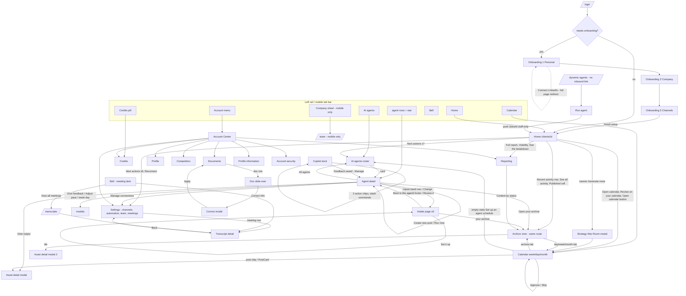

# Karos CMO — client portal flow audit

Scope: every screen and control a `CLIENT_USER` can reach. Staff-only controls are named where they
sit on a shared page but are excluded from findings. All paths are relative to
`/Users/albertkattan/Karos Labs CMO/.claude/worktrees/instagram-post-ordering-5c8eaa`.

Given (product-owner decisions, not re-proposed here): Home lists recommended tasks with an X and a
"Let's do this" that goes to the input page; "Generate more" is removed; agent detail pages show only
their own connectors.

Destination-type vocabulary used in the tables:
`page` = navigates to a sub-page · `modal` = overlay dialog · `sheet` = mobile full-screen sheet ·
`menu` = dropdown · `inline` = in-place state change, no navigation · `action` = server action with
no navigation · `external` = new browser tab · `query` = same page, URL query/state change.

---

## 1. Flow map

### 1.0 Entry and shell

`src/app/(app)/layout.tsx:124-227` mounts the client shell only for `role === "CLIENT_USER"` with a
`clientId`. `:45` redirects the entire portal to `/onboarding` until the wizard is done. The shell is
`ClientRail` + `<main>` + `CopilotDock`; there is no top bar on desktop and no hamburger by contract.

### 1.1 Desktop left rail — `src/components/client-rail.tsx`

| Label | file:line | Does | Type | Destination | Flow ends |
|---|---|---|---|---|---|
| Karos Labs logo + wordmark | client-rail.tsx:132 | Home | page | `/clients/{id}` | Home; rail persists |
| Brand card: company mark + name | client-profile-panel.tsx:513-536 | nothing (static) | — | — | — |
| ✎ Contact icon "Edit brand profile" | client-profile-panel.tsx:539-546 | opens Brand Profile dialog (picture, contact email) | modal | in place | Save/Cancel closes; stays on current page |
| ✎ Pencil "Edit company profile" | client-profile-panel.tsx:547-555 | switches the rail card into an inline edit form | inline | in place | Save/Cancel returns the card |
| "Add team size & category" chip | client-profile-panel.tsx:616-623 | same inline edit form | inline | in place | as above |
| Social square (per connected account) | client-profile-panel.tsx:644-658 | opens the client's own social profile | external | e.g. instagram.com/… | leaves the app; no return path |
| Brand color swatch ×4 | client-context-sections.tsx:434-441 | copies hex to clipboard | inline | — | tooltip says "Copied" |
| ✎ Pencil "Edit branding guidelines" | client-context-sections.tsx:497-505 | opens `BrandingModal` | modal | in place | close returns to current page |
| Home | client-rail.tsx:74 (via rail-nav-link.tsx:37) | nav | page | `/clients/{id}` | — |
| AI agents | client-rail-agents-nav.tsx:185-196 | nav | page | `/clients/{id}/agents` | — |
| Agent row (starred, then unstarred, cap 6) | client-rail-agents-nav.tsx:57-76, 208-243 | nav | page | `/clients/{id}/agents/{agentId}` | agent detail |
| ★ star toggle per row | client-rail-agents-nav.tsx:77-92 | `toggleStarredAgentAction` + `router.refresh()` | action | — | row re-sorts optimistically |
| "View all N agents" / "Show fewer" | client-rail-agents-nav.tsx:244-252 | expands the capped list | inline | — | — |
| Calendar | client-rail.tsx:75 | nav | page | `/calendar` | — |
| Credits pill (`Credits · N`) | client-rail.tsx:201-215 | nav | page | `/clients/{id}/settings?tab=credits` | Account Center, Credits tab |
| 🔔 Notification bell | notification-bell.tsx:238-263 | opens panel above the rail | menu | in place | see 1.2 |
| Account row (avatar + name + `{client} · Account Center`) | account-menu.tsx:95-121 | opens the account menu | menu | in place | — |
| ↳ Account Center | account-menu.tsx:142-148 | nav | page | `/clients/{id}/settings` | — |
| ↳ Theme toggle | theme-switch.tsx:29 | light/dark | inline | — | — |
| ↳ Support | contact-us-modal.tsx:77-84 | opens Contact Support dialog | modal | in place | Send / Cancel closes |
| ↳ Log out | logout-button.tsx:29 | signs out | action | `/login` | session ends |

### 1.2 Notification bell panel — `src/components/notification-bell.tsx`

| Label | file:line | Does | Type | Destination | Flow ends |
|---|---|---|---|---|---|
| Review row (agent draft ready) | notification-bell.tsx:546-553 | client rows are **inert** (`deepLink` false for a client, `:187`) | — | — | **dead end** — the row names work with nowhere to go |
| Task alert row | notification-bell.tsx:~340 | inert for a client (same ruling as Home's attention rows) | — | — | dead end |
| Meeting action item | notification-bell.tsx:376-383 | nav | page | `/transcripts/{transcriptId}` | transcript detail |
| ✓ dismiss action item | notification-bell.tsx:386-391 | local dismissal set | inline | — | count drops |
| "…jobs" footer link | notification-bell.tsx:408-414 | staff only (`showJobsLink = !viewerIsClient`, `:196`) | — | — | — |
| "…meetings" footer link | notification-bell.tsx:417-423 | nav | page | `/transcripts` | list page |
| Empty state "All caught up!" | notification-bell.tsx:305-306 | — | — | — | no action offered |

### 1.3 Mobile chrome — `src/components/mobile-shell.tsx` + rail

| Label | file:line | Does | Type | Destination | Flow ends |
|---|---|---|---|---|---|
| Top bar wordmark | client-rail.tsx:237-247 | Home | page | `/clients/{id}` | — |
| Top bar credits pill | client-rail.tsx:250-258 | nav | page | `?tab=credits` | — |
| Tab: Home | mobile-shell.tsx:108-119 | nav | page | `/clients/{id}` | — |
| Tab: Calendar | mobile-shell.tsx:108-119 | nav | page | `/calendar` | — |
| Tab: Company (last tab, dot = unread) | mobile-shell.tsx:121-139 | opens the Company sheet | sheet | in place | X at `:159-165` closes |
| Sheet: brand card + colors | client-rail.tsx:275-284 | same controls as the rail | modal/inline | — | — |
| Sheet: agent roster + stars | client-rail.tsx:292-299 | same as rail | page/action | — | closes on navigation |
| Sheet: Account Center | client-rail.tsx:308-315 | nav (explicit close) | page | `/clients/{id}/settings` | — |
| Sheet: **Team** (only if `isGroupAdmin`) | client-rail.tsx:316-325 | nav | page | `/team` | **only route to `/team` in the whole client portal** — absent from the desktop rail and the account menu (grep: the sole client-side producer) |
| Sheet: Notifications (row variant) | client-rail.tsx:335-345 | opens the bell panel inside the sheet | menu | — | — |
| Sheet: Support | client-rail.tsx:347 | Contact modal | modal | — | — |
| Sheet: Theme | client-rail.tsx:349 | toggle | inline | — | — |
| Sheet: Log out | client-rail.tsx:354 | sign out | action | `/login` | — |

### 1.4 Copilot dock — `src/components/copilot-dock.tsx` + `chatbot-widget.tsx`

| Label | file:line | Does | Type | Destination | Flow ends |
|---|---|---|---|---|---|
| "AI Copilot" strip (< lg) | copilot-dock.tsx:201-214 | opens the bottom sheet | sheet | in place | outside click or ✕ closes; transcript preserved |
| Edge handle ‹ / › (lg+) | copilot-dock.tsx:234-242 | expand/collapse the 380px rail | inline | — | persisted in `localStorage` |
| Collapsed strip (whole 48px column) | copilot-dock.tsx:278-299 | expand | inline | — | `aria-hidden`, pointer-only |
| Model picker "Auto / …" | chatbot-widget.tsx:638-662 | chooses the chat model | inline | — | — |
| ⟲ "Clear conversation" | chatbot-widget.tsx:1146-1151 | destroys the thread | action | — | **no undo, no confirm** |
| ⌄ "Collapse copilot" | chatbot-widget.tsx:1156-1161 | closes the sheet | inline | — | — |
| Action chip "Competitor Deep-Dive" | chatbot-widget.tsx:151-159, 756-775 | sends a hidden prompt (Sonnet) | inline | transcript | ends as prose in the chat |
| Action chip "Brand Visibility Audit" | chatbot-widget.tsx:160-169 | as above | inline | transcript | as above |
| Action chip "Content Plan" | chatbot-widget.tsx:170-196 | as above | inline | transcript | as above |
| Suggestion pills ("What's our brand positioning?" etc.) | chatbot-widget.tsx:845-857, 889-899 | sends the text | inline | transcript | — |
| "AI actions" disclosure (once a transcript exists) | chatbot-widget.tsx:1272-1291 | re-reveals the three chips | inline | — | — |
| `/` command palette (6 commands) | chatbot-widget.tsx:218-250, 1370 | inserts a scaffold sentence into the input | inline | — | user must finish and send |
| `@` agent mention | chatbot-widget.tsx:1345 | focuses one agent | inline | — | ✕ at `:1322` clears |
| "Feedback saved · Manage" chip | chatbot-widget.tsx:717-731 | nav | page | `/clients/{id}/agents/{agentId}` | agent detail |
| Send ▲ | chatbot-widget.tsx:1435-1440 | sends | action | transcript | — |

**The copilot has exactly one link out** (the feedback chip, `:719`). `/edit-output`, `/inspect-job`,
`/reschedule-post` and `/schedule-run` all resolve to model prose in the transcript — the deliverable
they act on is never rendered as a card or a link, so "copilot → deliverable" terminates in the chat.

### 1.5 Home — `src/app/(app)/clients/[id]/page.tsx` (client branch, `:640-701`)

Order: welcome line → sparse-calendar banner → Next actions + Calendar → Your numbers → SEO & AI
visibility → Needs your attention + Recent activity.

| Label | file:line | Does | Type | Destination | Flow ends |
|---|---|---|---|---|---|
| Banner "Review on your calendar" | calendar-sparse-banner.tsx:76-80 | nav | page | `/calendar` | calendar; review cards there |
| Banner "Generate more" | calendar-sparse-banner.tsx:81-87 | opens Strategy War Room, charges on press | modal | in place | *(being removed)* |
| Banner "Generate recommended tasks" (sparse) | calendar-sparse-banner.tsx:103-108 | same control, different label | modal | in place | *(being removed)* |
| Banner "Generate recommended tasks" (quiet) | calendar-sparse-banner.tsx:127-132 | same control, third placement | modal | in place | *(being removed)* |
| Banner ✕ dismiss | calendar-sparse-banner.tsx:111-118 | session-only hide | inline | — | returns next visit |
| Next actions: row (×15 possible) | home-action-list.tsx:83-98 | nav | page | per `action-list.ts` `hrefFor` | see below |
| Next actions: 🕐 "Dismiss for now" | home-action-list.tsx:105-112 | `dismissActionAction` | action | — | row greys to "Snoozed"; **no undo** |
| Next actions: ✕ "Not relevant for me" | home-action-list.tsx:113-120 | `markActionNotRelevantAction` | action | — | row disappears permanently; **no undo, no confirm** |
| Next actions: "See all N" / "Show less" | home-action-list.tsx:67-75 | expand | inline | — | — |
| Calendar widget "Open calendar" | home-calendar-preview.tsx:78-83 | nav | page | `/calendar` | — |
| Calendar widget rows | home-calendar-preview.tsx:99-116 | **inert** | — | — | dead end — a listed upcoming post cannot be opened from here |
| Your numbers "Full report" | home-kpis.tsx:230-236 | nav | page | `?tab=reporting` | Account Center |
| Your numbers "Published · 30 days" cell | home-kpis.tsx:265-287 | nav | page | `/calendar?view=archive&status=published` | archive |
| Your numbers "Visibility" cell | home-kpis.tsx:290-298 | nav | page | `?tab=reporting` | same as "Full report" |
| SEO card "See the breakdown" | home-standing.tsx:143-149 | nav | page | `?tab=reporting` | third route to the same tab |
| SEO card empty-share tile | home-standing.tsx:180-192 | nav | page | `?tab=competitors` | — |
| Attention: primary panel button | client-home-overview.tsx:599-607 | nav | page | "Open calendar" `/calendar` or "Reconnect" `?tab=settings` | — |
| Attention: secondary rows | client-home-overview.tsx:630-654 | link **only if** `href`; otherwise a plain div | page / none | — | "tasks ready for review" and "pending tasks" are **deliberate dead ends** (`:299-341`) |
| Recent activity row | client-home-overview.tsx:503-509 | link only when the asset is in the 30-day archive | page | `/calendar?view=archive` | archive list — **not** the item |
| "See all activity (N more)" | client-home-overview.tsx:525-534 | nav | page | `/calendar?view=archive` | same destination as every row above it |

`action-list.ts` destinations (15 client rows + 8 conditional): 7 rows → `/clients/{id}/agents`
(`:79,86,93,111,125,132,146`), 6 rows → `?tab=settings` (`:192,199,206,213,220` + channels), 3 →
`?tab=profile`/`?tab=documents`, 2 → `?tab=competitors`, 4 → `/calendar` or `/calendar?view=archive`
(`:104,153,160,171,178`), 1 → `?tab=credits`.

### 1.6 Agents roster — `src/app/(app)/clients/[id]/agents/page.tsx` (client branch `:87-367`)

| Label | file:line | Does | Type | Destination | Flow ends |
|---|---|---|---|---|---|
| Page header "AI agents" + one line | agents/page.tsx:337 | — | — | — | — |
| Agent card (whole card) | roster-card.tsx:136-139 via roster.tsx:78-88 | nav | page | `/clients/{id}/agents/{agentId}` | detail |
| Chevron on the card | roster-card.tsx:102-108 | decorative (`aria-hidden`) | — | — | — |
| Paused card ("Coming Soon") | roster-card.tsx:124-130 | not clickable | — | — | **dead end by design**, with no explanation of when |
| Empty state "No active agents yet" | agents/page.tsx:359-363 | no action | — | — | **dead end** — no way to ask for an agent |
| Outage notice | agents/page.tsx:344-348 | text only | — | — | tells the client to contact Karos; no Support button |
| "Staff tools" menu | agents/page.tsx:648-659 | staff only | — | — | — |

### 1.7 Agent detail — `src/app/(app)/clients/[id]/agents/[agentId]/page.tsx`

| Label | file:line | Does | Type | Destination | Flow ends |
|---|---|---|---|---|---|
| "‹ All agents" | agents/[agentId]/page.tsx:917-922 | nav | page | `/clients/{id}/agents` | back to roster — the only breadcrumb in the portal |
| "Pin to sidebar" / "Pinned" | agent-star-button.tsx:44-59 | `toggleStarredAgentAction` | action | — | rail re-sorts |
| Status strip | agent-sections.tsx:129-181 | — | — | — | — |
| "Set up this agent" (not-set-up hero) | agent-setup-hero.tsx:65-68 | opens `RunCustomAgentModal` at the data pane | modal | in place | `stayOnPage`; close returns here |
| "Create new {post/clip/reply}" | agent-detail-panel.tsx:193-201 | runs the **first runnable format**, `runClientAgentTemplateAction` | action | — | banner appears; `router.refresh()` |
| Blocked-run reason + "{setup label} →" | agent-detail-panel.tsx:211-218 | nav | page | intake page | — |
| Blocked-run "Support" row (credits short) | agent-detail-panel.tsx:219-223 | Contact modal | modal | — | — |
| "Cancel run" | agent-detail-panel.tsx:166-169 | cancels, refunds | action | — | banner clears |
| Format row title (disclosure) | live-card.tsx:170-188 | expands rationale + posts | inline | — | — |
| Format ▲ / ▼ | live-card.tsx:249-267 | reorder | action | — | — |
| Format "Run now" | live-card.tsx:271-281 | runs that format | action | — | **second run gesture on one page** |
| Format "Feedback" | live-card.tsx:290-291 | opens feedback modal, template scope | modal | — | — |
| Format "Pause"/"Resume" | live-card.tsx:293-296 | toggles | action | — | — |
| Week strip day | live-card.tsx:467-478 | opens `SlotNoteModal` | modal | — | note saved, modal closes |
| "Give feedback" | agent-detail-panel.tsx:306-308 | same modal, agent scope | modal | — | — |
| "Adjust pace" | agent-detail-panel.tsx:310-312 | `AgentScheduleModal` (pace-only for clients) | modal | — | — |
| Options picker "Choose"/"Edit" (options-mode agents) | option-picker.tsx:130-160 | picks today's direction | action | — | replaced by "You chose today's post" |
| Inputs band row **with** answers | agent-sections.tsx:250-289 | `
` disclosure | inline | — | — |
| ↳ "Change this →" | agent-sections.tsx:281-286 | nav | page | `{intake}#intake-{rowId}` | intake page, anchored |
| Inputs band row **empty** | agent-sections.tsx:291-299 | nav | page | same anchored intake | — |
| Inputs band footer "{Your X details} →" | agent-sections.tsx:303-312 | nav | page | intake page | — |
| Run history "Show all" | client-agent-run-history.tsx:30-37 | expand | inline | — | rows are inert |
| Archive row "View output" (button) | agent-archive-rows.tsx:81-89 | opens `AssetDetailModal` | modal | in place | ✕ returns here |
| "Open your archive →" | agents/[agentId]/page.tsx:1280-1285 | nav | page | `/calendar?view=archive` | archive |
| Sidebar "Review it"/"Set it up" | agents/[agentId]/page.tsx:1342-1347 | nav | page | intake page | **third control on this page to the same intake** |
| Sidebar "Manage connections →" | agents/[agentId]/page.tsx:1394-1399 | nav | page | `?tab=settings` | — |
| Launch card "Launch"/"Confirm"/"Reset" | launch-card.tsx:143-240 | umbrella launch flow | action/inline | — | — |
| Launch card setup link | launch-card.tsx:166-167 | nav | page | `agent.setupHref` | — |
| Clip tile | clip-gallery.tsx:101 | opens the clip | modal | — | — |
| Daily finder batch row | daily-finder-panel.tsx:198 | expands | inline | — | — |

### 1.8 Calendar — `src/app/(app)/calendar/**` + `src/components/run-calendar.tsx`

`/clients/{id}/calendar` redirects a client to the flat `/calendar`, carrying `?view`/`?status`
(`clients/[id]/calendar/page.tsx:25-38`). Client props: `viewerIsClient=true`, `canSchedule=false`,
`canManageRuns=true` (`calendar-body.tsx:839-844`). Default view: Week (`run-calendar.tsx:1630`).

**Page level**

| Label | file:line | Does | Type | Destination | Flow ends |
|---|---|---|---|---|---|
| "Set up an agent schedule" (empty state only) | calendar-body.tsx:801-808 | nav | page | `/clients/{id}/agents` | leaves the calendar; **no return link** |
| Sparse banner (3 variants) | calendar-sparse-banner.tsx:68-133 | see 1.5 | modal | War Room | *(being removed)* |
| Day picker + "Download .zip" | client-downloads.tsx:47-72 | day bundle; also marks action 15 done | external download | `/api/clients/{id}/downloads` | stays |

**Header / view switcher**

| Label | file:line | Does | Type | Flow ends |
|---|---|---|---|---|
| ‹ / › `Previous {view}` `Next {view}` | run-calendar.tsx:1879-1893 | shift anchor | inline | hidden in archive (`:1877`) |
| `day` `week` `month` `archive` | run-calendar.tsx:1901-1918 | `setViewMode` | inline | **writes nothing to the URL** |
| Legend chips: Draft / Scheduled / Posted / Waiting / Placeholder / Failed / Suggested | run-calendar.tsx:2134-2144 | dim that status on the grid | inline | rendered **also in archive view**, where they do nothing |
| "Schedule a run" | run-calendar.tsx:1863-1876 | staff only (`canSchedule`) | — | — |

**Grid**

| Label | file:line | Does | Type | Flow ends |
|---|---|---|---|---|
| Post chip (label = post title) | run-calendar.tsx:352-395; mounted :1382, :1423, :1498, :2010, :2053 | opens `AssetDetailModal` | modal | ✕/Esc returns; page may have changed underneath |
| Run chip (label = agent name) | run-calendar.tsx:290-317 | **nothing** — plain div | — | dead visual |
| Suggestion chip | run-calendar.tsx:407-426 | **nothing** in month view; in week/day the *parent cell* opens the day panel | inline | its own docstring claims it opens the day detail — true in Week, false in Month |
| Day number / day cell / "Tue 17 · 3 items ›" | run-calendar.tsx:1975-1989, 1351-1368, 1408-1418, 2037-2049 | opens the day-detail panel | inline | ✕ at `:2153` collapses it |
| "+N more" | run-calendar.tsx:2016 | nothing | — | non-interactive overflow |

**Day-detail panel**

| Label | file:line | Does | Type | Flow ends |
|---|---|---|---|---|
| Suggestion **Approve** | pending-task-suggestions.tsx:135-143 → `:62-73` | `updateTaskStatusAction(id,"in_progress",clientId,at)` | action | row vanishes in place; **no confirmation, no link to the run it started** |
| Suggestion **Skip** | pending-task-suggestions.tsx:127-134 → `:75-86` | `deleteTaskAction` — hard delete | action | **no confirm, no undo** |
| Schedule "Add"/"Edit" instructions → "Save"/"Cancel" | run-calendar.tsx:587-626 | `updatePlannedRunPromptAction` | action | editor collapses |
| Schedule **Pause** | run-calendar.tsx:749-757 | `setPlannedRunStatusAction` | action | **the card unmounts**; reassurance moves to a notice + strip |
| Paused notice **Resume** / **Dismiss** | run-calendar.tsx:1007-1012 | resume / hide the message | action / inline | "Dismiss" sits beside "Resume" and dismisses only the message |
| Paused strip **Resume** | run-calendar.tsx:920-922 | identical action | action | **duplicate of the notice's Resume** |
| Past-run card heading (client) | run-calendar.tsx:1112-1129 | opens the run's **first** asset | modal | the heading is agent name + badge; **nothing says it is pressable** |
| "Review deliverable →" | run-calendar.tsx:1155-1169 | requires `jobStatus === "review"` | — | **unreachable for a client** (`calendar-past-runs.ts:72`) |
| `PostCard` body (`role="button"`) | run-calendar.tsx:1242-1252 | opens `AssetDetailModal` | modal | duplicate of the chip that opened this panel |
| Cover thumbnail | run-calendar.tsx:1255-1264 | `ImageLightbox` | modal | ✕ / arrows |
| Inline "Mark as posted" | mark-posted-row.tsx:85-105 | `markAssetPostedAction` | action | chip disappears |
| "View job", "Delete schedule", "Stop" | run-calendar.tsx:698, 762, 902 | staff only | — | — |

**Asset detail modal** (`asset-detail-modal.tsx`; two separate instances — `run-calendar.tsx:2240` and `archive-view.tsx:361`)

| Label | file:line | Does | Type | Flow ends |
|---|---|---|---|---|
| ✕ / Esc / backdrop | modal.tsx:67, 138, 159-165 | close | inline | focus returns to opener |
| "Details" / "Audience Simulation" tabs | asset-detail-modal.tsx:267-272 | switch | inline | — |
| "Run simulation" / "Re-run" / "Try again" | audience-simulation.tsx:98-135 | **charges the client** on press | action | results render in the tab; no price confirm |
| "Copy caption" | copy-caption-button.tsx:122-141 | clipboard | inline | label reverts |
| "Download" / "Download all (N)" / "Download video" | asset-detail-modal.tsx:437-442 | file | external download | suppressed for locked assets |
| "Mark as posted" | mark-posted-row.tsx:128-147 | action | action | control disappears; modal stays open over a changed page |
| Drafts reader: "Pick & post on LinkedIn/X" | li-drafts-review.tsx:318-321, x-drafts-review.tsx:268-271 | records `posted`, copies, **opens the platform in a new tab** | action + external | leaves the app |
| Drafts reader: "Pick with edits" / "Request a change" / "Skip" | li-drafts-review.tsx:325-338 | inline editors + actions | inline/action | — |
| Locked (future) asset | asset-detail-modal.tsx:197-228 | renders "Upcoming post" copy and **no controls** | — | ✕ is the only exit |
| Approve / Unschedule / Publish Now / Unpublish / Delete | asset-detail-modal.tsx:444-460 | staff only | — | — |

**Archive** (`archive-view.tsx`, mounted at `run-calendar.tsx:2103-2116`)

| Label | file:line | Does | Type | Flow ends |
|---|---|---|---|---|
| Status select (Draft excluded for clients) | archive-view.tsx:239-251 | filter | inline | — |
| Agent select (only if >1 agent) | archive-view.tsx:253-266 | filter | inline | — |
| "Search by title" | archive-view.tsx:267-273 | filter | inline | — |
| Group header (chevron only) | archive-view.tsx:291-331 | collapse/expand | inline | no text affordance |
| "Show all {N} · {M} more" | archive-view.tsx:345-353 | expand | inline | **one-way, no "Show fewer"** |
| Archive tile | archive-view.tsx:386-421 | opens the second `AssetDetailModal` | modal | returns with filters intact |
| Empty state "Nothing here yet" | archive-view.tsx:218-230 | — | — | **no action offered** |

Entered by the `archive` tab or `?view=archive`; exited only by pressing `day`/`week`/`month`. It is
a **mode of the calendar component, not a route** — no back link, no breadcrumb, prev/next hidden.

**URL state**: `view` and `status` are read (`page.tsx:12-25`, `calendar-body.tsx:152-154, 746`) and
**nothing is written back** (`run-calendar.tsx:1630, 1905-1908`; `archive-view.tsx:162`). View mode,
week anchor, legend filters, archive filters, selected day and open asset are all invisible to the
URL, so nothing on this page is shareable or Back-safe, and a deep link to `?view=archive` still
reads `view=archive` after the user has switched to `week`.

`src/components/task-ticket-modal.tsx` has **no production mount** — its only importer is a test
(`src/lib/__tests__/task-no-deliverable-card.test.tsx:30`). It is dead UI.
### 1.9 Agent intake pages — `/clients/[id]/{x|linkedin|reddit|blog|newsletter|reputation}-agent`, `/dynamic-agents`

**Routing.** There is no single mapping table. `buildAgentSetup` holds the real one
(`src/lib/client-agent-rows.ts:322, 352, 367, 392, 426, 447`), pairing each family with a route and a
client label ("Your X details"). A **second, independent copy** lives in `INTAKE_ROUTE`
(`src/components/custom-agents.tsx:465-472`), used only by the run dialog's error-recovery link
(`:2851`) — two tables that can drift. Family detection: `agent-detail-sections.ts:261-269`,
`agent-intake-views.ts:93-110`. `src/lib/agent-intake-links.ts` owns only the anchor helpers
(`:36-57`), `clientArchiveLink` (`:83-91`) and `intakePageAction` (`:149-176`).

**Nothing in the rail links to an intake page.** They are reached only from the agent detail page —
via the inputs band row (`agent-sections.tsx:282, 293`), the band footer (`:304`), or the sidebar
"Review it"/"Set it up" card (`agents/[agentId]/page.tsx:1342-1347`). `/clients/[id]/dynamic-agents`
has **zero inbound links anywhere in the repo** — it is URL-only.

| Page | Back link | H1 | Label of the control that leads here |
|---|---|---|---|
| X | "Back to the agent" / "Your agents" (x-agent/page.tsx:59) | "X agent" (:56) | "Your X details" / "Change this" / "Review it" |
| LinkedIn | linkedin-agent/page.tsx:62 | "LinkedIn agent" (:59) | "Your LinkedIn details" |
| Reddit | reddit-agent/page.tsx:62 | "Reddit agent" (:59) | "Your Reddit details" |
| Blog | blog-agent/page.tsx:57 | "Blog agent" (:54) | "Your blog details" — which is **also** the title of a card on the page (blog-agent-intake.tsx:190) |
| Newsletter | newsletter-agent/page.tsx:57 | "Newsletter agent" (:54) | "Your newsletter details" — same collision (newsletter-agent-intake.tsx:229) |
| Reputation | reputation-agent/page.tsx:57 | "Reputation agent" (:54) | **"Your review details"** (client-agent-rows.ts:449) — a different word from the destination's title |
| Dynamic agents (list) | **none** (dynamic-agents/page.tsx:46) | "Dynamic agents" | no entry control exists |
| Dynamic agent run | **none** ([specId]/page.tsx:30) | `{spec.name}` | the list row |

**Controls shared by the six lab intakes**: `SavedFormCard` "Edit" (saved-form-card.tsx:47-50) →
form → "Save {…}" (server action, collapse + `router.refresh()`) / "Cancel"; a feedback box on four
of six ("Send feedback", inline "Sent. It feeds the next run."); a "your archive" link
(`/calendar?view=archive`); up to four read-only run rows; seat add/edit/remove on X and LinkedIn
(`client-seat-remove.tsx:96-147`, two-step confirm).

**X-specific**: "Propose accounts" / "Refresh proposal" (`x-agent-intake.tsx:205-207`) — **charges 1
credit with no price shown and no confirm** (`x-agent-actions.ts:334-349`); "Drop the take" (`:427`);
"Drop the update" (`company-news-box.tsx:140`). **X has no setup run at all.**

**LinkedIn-specific**: "Set it up" (`:441-443`), "Build their voice" (`:496-498`), seat pills
(`:292-322`), CV upload (`:747-760`), direction requests "Add it"/"Remove" (`:196`, `:207-214`, one
step, no confirm). **"Save company page" silently fires a billable setup run on first save**
(`:568-570`) and **"Add seat" silently fires that seat's voice run** (`:1015-1018`), whose failure is
swallowed (`:1006-1014`).

**Dynamic agents**: admin-authored fields; **"Run agent"** (`dynamic-agent-intake-form.tsx:299-301`)
→ `router.push('/jobs/{jobId}')` (`dynamic-agent-run.tsx:33`) → `/jobs/[id]` is staff-only
(`jobs/[id]/page.tsx:32`) → the client is bounced to `/dashboard` → `/clients/{id}`. **The one
"Run" button a client can press ends by throwing them back to Home with no explanation.**

**Three different submit models across seven sibling pages:**
1. *save only* — Reddit (`reddit-agent-intake.tsx:95-117`). No run control at all.
2. *save + "Set it up"* — Blog `:82-93`, Newsletter `:107-118`, Reputation `:81-92`, LinkedIn
   `:387-400`. On success the button is replaced by **"Setup is running. This page updates itself
   when it finishes."** (blog `:123-125`, newsletter `:148-150`, reputation `:122-124`, linkedin
   `:430-432`) — **there is no poll, no `AutoRefresh`, no interval on any of the four.** The promise
   is never kept; the client waits on a static page.
3. *run + navigate* — Dynamic agents only, and the navigation is the broken one above.

**Where the output lands** is promised as "your archive" on all six lab pages (x `:741-749`, linkedin
`:1162-1170`, reddit `:321-329`, blog `:323-330`, newsletter `:407-415`, reputation `:327-334`) and
**not promised at all** on dynamic agents — the only feedback there is `"Submitted, job {jobId}."`
(`dynamic-agent-run.tsx:47`), a raw id on a page the user is immediately navigated off.

**Credits**: no price is displayed on any of the seven pages, and no press is confirmed. Charged
presses: "Propose accounts" (1 credit), the four "Set it up" buttons, LinkedIn's two silent
auto-fires, "Build their voice", and dynamic "Run agent" (`submit-custom.ts:622-630, 1029-1032`).

**Blocked / empty states**: a client without a grant gets a **bare 404** (`notFound()`,
`agent-intake-views.ts:182`). "Set it up" is correctly disabled with the reason and the remedy on the
same page (blog `:129-131` etc.). "No runs yet" and "no feedback yet" render **nothing at all** —
the sections are omitted (`x:750`, `linkedin:1171`, `reddit:330`, `blog:331`, `newsletter:416`,
`reputation:335`). Failure copy tells the client to "contact your Karos team" while **no intake page
carries a Contact control** (`custom-agent-launch.ts:1549-1550`). `dynamic-agent-run.tsx` bypasses
`intake-save.ts`, so a rejected action leaves a dead button with no message, and raw config errors
(`"AGENT_SERVICE_URL / AGENT_SERVICE_TOKEN"`, `submit-custom.ts:925`) can reach a client verbatim.
### 1.10 Account Center — `/clients/[id]/settings`

Title "Account Center" (`settings/page.tsx:740-742`). A CLIENT_USER sees **8 tabs**; staff see 6
(`settings/page.tsx:712-719` + account tabs appended at `:736`).

| # | id | Label | Client-visible | Built at |
|---|---|---|---|---|
| 1 | `profile` | Profile | yes (staff `ClientEditor` block inside, `:329-333`) | settings/page.tsx:713 |
| 2 | `competitors` | Competitors | yes | :714 |
| 3 | `reporting` | Reporting | yes | :715 |
| 4 | `settings` | Settings (Channels + Automation + Team + Meetings) | yes; admin frame `:555-598` | :716 |
| 5 | `documents` | Documents | yes; Regenerate is admin | :717 |
| 6 | `credits` | Credits | yes; grant/limits admin | :718 |
| 7 | `account` | **Profile information** | CLIENT_USER only | :653-658 |
| 8 | `security` | Account security | CLIENT_USER only | :660-669 |

Two tabs were retired and now server-redirect: `?tab=archive` → `/calendar?view=archive`
(`:116-126`), `?tab=meetings` → `?tab=settings#meetings` (`:127-132`).

**Tab mechanics.** Seeded server-side (`:89, 93, 775`), held in `useState`
(`settings-tabs.tsx:47-49`), switched with `window.history.replaceState` (`:72-73`). Deep links work
(including `#meetings`, `:62-67`); **Back does not step through tabs — it leaves the page**. Only the
active panel is in the DOM (`:117`), so find-in-page cannot reach the other seven.

Note the id collision: tab 1 is `profile` (the *company*), tab 7 is `account` labelled **"Profile
information"** (the *person*). Two tabs called Profile-something, in one strip.

**Profile tab** — the same brand card as the rail plus the same three editors: "Edit brand profile"
(modal, `client-profile-panel.tsx:539-546`), "Edit company profile" (inline, `:547-554`), "Edit
branding guidelines" (`BrandingModal`, `client-context-sections.tsx:498-505`). Inside the Brand
Profile sheet: Upload/Replace/**Remove** logo (`:337-361`, immediate writes, **no confirm**), contact
email / website / about (deferred to Save) — two commit semantics behind one Save/Cancel pair.
`BrandingModal` (`branding-modal.tsx:210-417`) holds "Generate with AI" (`:228-231`, mutates the form
but does **not** save), 4 colour rows, 2 fonts, a style select, a tone-chip editor and a markdown
document, all behind one "Save guidelines". The Seats list (`settings/page.tsx:303-321`) is read-only
and tells the client to edit seats "from that agent's own setup page" **with no link**.

**Competitors tab** — "+" `Add competitor` (`client-context-sections.tsx:189-231`), row = external
link to the competitor site (`:291-302`, rows with no derivable URL render inert), trash "Stop
tracking {company}" (`:305-320`, **no confirm**), "View all N" / "Show fewer" (`:331-344`).

**Reporting tab** — "Content by status" bars → `/calendar?view=archive&status=…`
(`client-analytics.tsx:227, 258-264`); "Manage" and "Reconnect needed →" → `?tab=settings`
(`:291-293, 316-321`); "Open / Set up the Reputation agent" → the agent page
(`settings/page.tsx:390-400`, **no back link from there to Account Center**); "Approve" on action-plan
rows (`seo-geo-action-plan.tsx:130-138`); "Ask the Karos team" / "Flag to the Karos team" →
support modal (`seo-geo-panel.tsx:461-465`, `seo-geo/flag-button.tsx:69-75`).

**Settings tab** — collapsed platform rows under "Add a channel" expand in place and **cannot be
re-collapsed** (`integrations-tab.tsx:218-235`, the `expanded` set only grows); "Connect with
{Platform}" opens an OAuth popup (`:91-126, 466-472, 1079`) — a popup closed early only stops the
spinner, **with no message** (`:1092-1097`); "Auto-publish scheduled content" switch (`:511-544`);
"Reconnect" (`:546-559`); **"Disconnect" is staff-only** (`:565-576`) so a client who connected the
wrong account has no self-serve remedy; "Coming soon" tiles say "Ask your Karos team" with no contact
control (`:486-501`); "Manage employee seats (n/limit)" opens a modal roster (`:588-594, 690-705`);
"Auto-schedule approved content" (`auto-schedule-toggle.tsx:45-61`); invite-key copy/replace
(`client-key-inline.tsx:71-113`, group-admin or staff only); **Meetings section** — the last 12
meetings, each row → `/transcripts/{id}?from=…` (`settings/page.tsx:623-635`), **no "see all"**.

**Documents tab** — a doc row opens a 50%-width slide-over (`client-documents.tsx:891-913` →
`DocOverlay :416-626`); "Export" opens a menu (`:351-396`) → "Export PDF" (`window.open`, falls back
to a raw `alert()` when blocked, `:301-304`) / "Export Markdown" (blob download); section index
buttons scroll within the doc (`:554-584`); **"Correct Info"** (`:504-511`) opens a second modal over
the slide-over (`correct-info-modal.tsx:80-180`) whose "Apply Correction" (`:168-175`) **charges
credits, then closes both the modal and the document** (`client-documents.tsx:617-621`), dropping the
client on the Documents list with no diff and no confirmation. Unavailable docs render as inert rows
(`:916-936`).

**Credits tab** — "What actions cost" disclosure (`credits-panel.tsx:248-271`); "Request more
credits" / "Ask about your limit" → the support modal (`:293-306`) **rendered only when spending is
already `blocked`** (`:281`). There is **no client-pressable top-up, plan or billing control at all**.

**Profile information / Account security** — avatar drop-zone, "Upload photo"/"Change photo",
"Remove" (no confirm) (`avatar-uploader.tsx:67-121`); name/phone + "Save changes"
(`settings-form.tsx:115-163`, 3.5s "Profile updated."); password form only when the account has a
password provider (`:293`) — a Google-only client gets `myaccount.google.com` as **plain text with no
link** (`:212-216`).

### 1.11 Meetings — `/transcripts` and `/transcripts/[id]`

Page title is **"Meetings"** (`transcripts/page.tsx:26-32`) though the route is `/transcripts`.
Client controls: "Active"/"Archived" tabs (`meetings-client.tsx:94-113`), search (`:121-127`),
"Newest/Oldest first" (`:131-138`), "Clear filters" (`:177-182`), and the meeting card →
`/transcripts/{id}?from=/transcripts` (`:249-286`). Timeframe/client selects and Archive are
staff-only (`:140, 289`).

Detail page: a single **"Back"** / "All meetings" link (`transcripts/[id]/page.tsx:42-48, 157-159`)
whose destination varies with `?from=` and is never named; action-item checkbox and assignee select
(`meeting-action-items.tsx:283-330`, a client's only option is themselves). Summary and the full raw
transcript are read-only with **no export or share control**.

Reachability of `/transcripts` for a client is inconsistent three ways: the rail has no Meetings row
by ruling (`client-rail.tsx:76-89`); Account Center's Meetings section links only individual rows;
the bell footer "View all meetings →" appears only when the client has meeting action items
(`notification-bell.tsx:197, 416-423`); and a CLIENT_USER with **no** `clientId` falls through to the
staff `Sidebar`, which *does* list Meetings (`sidebar.tsx:94`).

### 1.12 Onboarding — `/(onboarding)/onboarding`

Forced from the shell (`(app)/layout.tsx:45`); the wizard's own layout renders a bare centered box —
**no rail, no logout, no support link** (`(onboarding)/layout.tsx:14-20`) — and cannot be re-entered
once complete (`:12`).

| Step | Controls | file:line | Ends |
|---|---|---|---|
| 1 Personal Profile | avatar uploader; "Full name" (required); "Phone (optional)"; Resume/CV; **"Connect your LinkedIn"**; **"Next"** | onboarding-wizard.tsx:187-243 | LinkedIn does a full-page redirect (`:115-133`) and returns to `/onboarding?linkedin_seat=…` — **the wizard restarts at step 1** (`:78`). **No Back, no Skip, no exit.** |
| 2 Company Workspace | "Company name" (required); "Industry / niche"; **"Brand voice"** textarea; "Back"; "Next" | onboarding-wizard.tsx:254-290 | "Next" validates but **does not persist** step-2 fields — only "Finish setup" writes them (`:161`) |
| 3 Social Channels | the whole `IntegrationsTab` (Connect / Reconnect / auto-publish / seats); "Back"; **"Finish setup"** | onboarding-socials-step.tsx:55-64, onboarding-wizard.tsx:309-316 | `completeOnboardingAction` → `/dashboard` → `/clients/{id}`. **No success state, no welcome, no acknowledgement**, and the wizard is now unreachable |

The step indicator's numbered circles are **not** clickable (`onboarding-wizard.tsx:25-54`), and
there is no Skip on any step.

### 1.13 Main navigation graph

---

## 2. Findings, ranked by user impact

### F1 — The three run gestures are three different products, and one of them is broken
`agent-detail-panel.tsx:193-201` ("Create new {noun}", picks the first runnable format silently),
`live-card.tsx:271-281` ("Run now", per format, on the same page), and the four intake "Set it up"
buttons (`blog-agent-intake.tsx:134`, `newsletter:159`, `reputation:133`, `linkedin:441`) are three
vocabularies for one act. `dynamic-agent-run.tsx:33` adds a fourth ("Run agent") and then
`router.push('/jobs/{jobId}')` into a **staff-guarded route** (`jobs/[id]/page.tsx:32`), so the client
is bounced `/jobs/{id}` → `/dashboard` → `/clients/{id}`. The only explicit "Run" button in the client
portal ends on Home with no explanation.

### F2 — A written promise the code does not keep
Four intake pages replace the button with **"Setup is running. This page updates itself when it
finishes."** (blog `:123-125`, newsletter `:148-150`, reputation `:122-124`, linkedin `:430-432`).
There is no poll, no interval and no `AutoRefresh` on any of them; the single `router.refresh()` fires
before the job could start. The component that solves this already exists and is mounted on the agent
pages (`agents/page.tsx:333`, `agents/[agentId]/page.tsx:915`). A client waits on a dead page for a
15-minute run.

### F3 — Money is spent by controls that quote no price and ask no confirmation
"Propose accounts" charges 1 credit (`x-agent-actions.ts:334-344`) with nothing on screen saying so.
The four "Set it up" buttons charge a run. **LinkedIn charges silently twice**: first "Save company
page" auto-fires the setup run (`linkedin-agent-intake.tsx:568-570`) and "Add seat" auto-fires the
voice run (`:1015-1018`), whose failure is swallowed (`:1006-1014`). "Run agent" charges
`specSnapshot.creditsCost` (`submit-custom.ts:1029-1032`) with no figure rendered. "Run simulation"
in the asset modal charges on press (`audience-simulation.tsx:98-101`). Meanwhile the *only* controls
that do quote a price are "Create a new post" (`agent-detail-panel.tsx:186-191`), the format rows
(`live-card.tsx:284-289`) and "Generate more" (`refresh-task-map-button.tsx:82-95`) — so the product
has the pattern and applies it in three places out of eleven. And the Credits tab, where a client
goes when they run out, has **no top-up control at all**: "Request more credits" renders only once
spending is already blocked (`credits-panel.tsx:281, 293-306`).

### F4 — Irreversible actions with no confirmation and no undo
Calendar **"Skip"** hard-deletes a suggested task (`pending-task-suggestions.tsx:75-86` →
`deleteTaskAction`). Home **"Not relevant for me"** permanently removes an action row
(`home-action-list.tsx:113-120`). **"Stop tracking {company}"** (`client-context-sections.tsx:305-320`),
**"Remove"** logo (`client-profile-panel.tsx:352-361`), **"Remove"** avatar
(`avatar-uploader.tsx:112-121`), **"Remove color N"** (`branding-modal.tsx:291-298`), and the
copilot's **"Clear conversation"** (`chatbot-widget.tsx:1146-1151`, destroys a paid thread) all commit
on one press. The codebase already has a two-step inline confirm pattern
(`client-key-inline.tsx:94-116`, `client-seat-remove.tsx:115-152`, `run-calendar.tsx:727-743`) — it is
simply not applied to the client-facing half.

### F5 — Browser Back is a trapdoor on the two densest screens
The calendar writes **nothing** to the URL: view mode, week anchor, legend filters, archive filters,
selected day and open asset are all local state (`run-calendar.tsx:1630, 1905-1908`;
`archive-view.tsx:162`). Account Center writes `?tab=` with `replaceState`
(`settings-tabs.tsx:72-73`). So on both screens Back exits the page instead of undoing the last move,
and neither a filtered archive nor a specific week is shareable. Worse, a deep link to
`?view=archive` still reads `view=archive` after the user switches to Week — reload snaps back.

### F6 — The archive is a fourth item in a Day / Week / Month control
`run-calendar.tsx:1901-1918` puts `archive` in the same segmented control as three time ranges. It is
a different *kind* of view — no grid, no dates — and entering it hides the prev/next arrows
(`:1877`), leaves the grid legend chips on screen doing nothing (`:2118-2144`), and offers **no back
link, no breadcrumb and no "← Calendar"**. The only exit is a lowercase tab word.

### F7 — Onboarding is a room with no door
The `(onboarding)` layout renders a bare centered box: no rail, no logout, no support
(`(onboarding)/layout.tsx:14-20`), while `(app)/layout.tsx:45` bounces every other route back into it.
Step 1 has no Back and no step has a Skip (`onboarding-wizard.tsx:239-244`). "Connect your LinkedIn"
does a full-page redirect and returns the wizard to **step 1** (`:78, 115-133`). Step 2's fields —
including brand voice, the only writable brand-voice field in the product — are not persisted by
"Next" (`:135-146`); only "Finish setup" writes them (`:161`). And "Finish setup" redirects to Home
with **no success state at all**, on a wizard that can never be reopened (`(onboarding)/layout.tsx:12`).

### F8 — Dead ends: controls and rows that name work with nowhere to go
| Dead end | file:line |
|---|---|
| Bell: review rows and task rows are inert for a client (3 of 4 row kinds) | notification-bell.tsx:187, 460-476, 572-608 |
| Home attention rows "N tasks ready for review", "N pending tasks" | client-home-overview.tsx:299-341 |
| Home Calendar-preview rows (the same posts are openable on the calendar) | home-calendar-preview.tsx:99-116 vs run-calendar.tsx:352-395 |
| Calendar run chips (never clickable) and month-view suggestion chips | run-calendar.tsx:290-317, 407-426 |
| "Review deliverable →" — requires a status a client is never shown | run-calendar.tsx:1155-1169, calendar-past-runs.ts:72 |
| Agents roster empty state and paused "Coming Soon" cards — no action | agents/page.tsx:359-363, roster-card.tsx:124-130 |
| Archive empty state, Calendar-preview empty state, "no runs yet"/"no feedback yet" on all six intakes | archive-view.tsx:218-230, home-calendar-preview.tsx:85-90, x:750 etc. |
| "Coming soon" channel tiles say "Ask your Karos team" with no contact control | integrations-tab.tsx:486-501 |
| Seats card says "edit from that agent's own setup page" and gives no link | settings/page.tsx:303-321 |
| Google-only accounts: `myaccount.google.com` as plain text, not a link | settings-form.tsx:212-216 |
| Credits tab with no top-up | credits-panel.tsx:281, 311 |
| `/clients/[id]/dynamic-agents` — zero inbound links anywhere in the repo | dynamic-agents/page.tsx |
| Intake page without a grant → bare 404 | agent-intake-views.ts:182 |
| `task-ticket-modal.tsx` — no production mount at all | (only importer is a test) |

`EmptyState` accepts an `action` node (`ui.tsx:206-225`); **not one client-facing empty state passes
one**.

### F9 — Duplicate routes to one destination
| Destination | Client-visible routes in |
|---|---|
| `/calendar?view=archive` | **8** — Recent activity row (client-home-overview.tsx:504), "See all activity" (:525), KPI "Published" cell (home-kpis.tsx:265), action rows 05 and 14 (action-list.ts:104, 171), agent detail "Open your archive" (agents/[agentId]/page.tsx:1280), the six intakes' "your archive", the calendar's own `archive` tab, plus Reporting's status bars (client-analytics.tsx:258) |
| `?tab=settings` | **11+** — Home Reconnect, Reporting "Manage", Reporting "Reconnect needed →", agent detail "Manage connections", agents page staff link, five "Connect {platform}" action rows, the `?tab=meetings` redirect, the transcript back link |
| `?tab=reporting` | **3** — "Full report", the Visibility cell, "See the breakdown" (home-kpis.tsx:231, 290; home-standing.tsx:144) |
| `/clients/{id}/agents` | **7 action rows** (action-list.ts:79, 86, 93, 111, 125, 132, 146) + rail + "All agents" + calendar empty state |
| `?tab=credits` | 3 client-visible (desktop pill, mobile pill, action row 24) |
| The support dialog | 4 triggers, **3 different labels** ("Support", "Request more credits", "Ask/Flag to the Karos team") |
| `AssetDetailModal` | 8 openers and **two separate component instances** with different props (run-calendar.tsx:2240, archive-view.tsx:361) |

NN/g's finding on duplicate links applies directly: users do not know two links are the same and
spend attention deciding whether the destinations differ.

### F10 — Labels that don't say where they go
"Manage" (`client-analytics.tsx:291`), "Back" on a transcript whose destination varies with `?from=`
(`transcripts/[id]/page.tsx:157`), "Full report" / "See the breakdown" (neither names Account
Center), "Correct Info" (opens a billable AI rewrite), "Export" (opens a menu), "Add"/"Edit" under
"Instructions" (`run-calendar.tsx:587-597`), the past-run card heading that is silently a button for
clients (`run-calendar.tsx:1112-1129`), the archive group headers (chevron only,
`archive-view.tsx:291-331`), the lowercase `archive` tab, and three icon-only edit buttons with no
visible text (`client-profile-panel.tsx:539, 547`; `client-context-sections.tsx:498`).

### F11 — One vocabulary per thing is not held
| One thing | Spellings |
|---|---|
| Starring an agent | rail: "Star {name}" / "Unstar {name}" (`client-rail-agents-nav.tsx:79`); detail page: "Pin to sidebar" / "Pinned" (`agent-star-button.tsx:49, 58`) |
| Starting a run | "Create new {post}", "Run now", "Set it up", "Run agent", "Approve" |
| The support dialog | "Support", "Contact us", "Contact Support", "Contact support", "Request more credits", "Ask the Karos team", "Flag to the Karos team" |
| The intake page | link says "Your X details" / "Your review details", page title says "X agent" / "Reputation agent"; "Change this"; "Review it"; "Set it up" |
| "Not set up" | means "no intake document" on the form badge and "stand-up run not done" on the setup band — same words, same page |
| Feedback ack | "Sent. It feeds the next run." (x:809, linkedin:1230, reddit:379) vs "…the next issue." (newsletter:460) |
| Profile | tab 1 `profile` = the company; tab 7 `account` labelled "Profile information" = the person |

### F12 — Row affordance is inconsistent across four patterns
Whole-card link with a decorative chevron (`roster-card.tsx:136`), whole-row link with a trailing
`ChevronRight` (`home-action-list.tsx:83-98`), whole-row link with a trailing `ArrowRight`
(`client-home-overview.tsx:525-534`, `:630-654`), row + a separate **"View output"** button
(`agent-archive-rows.tsx:81-89`), and inert rows that look identical to all of the above
(`home-calendar-preview.tsx:99-116`, `client-agent-run-history.tsx:44-56`). Three different trailing
glyphs (chevron, arrow, none) and two different hover treatments (`row-lift` in globals.css:228 vs
`hover:border-border-strong`) are in play for the same "this opens something" meaning.

### F13 — Depth to a primary task
| Task | Clicks | Path |
|---|---|---|
| See what an agent made (one item) | **3** | rail agent row → "View output" (2) → modal. Or Calendar → chip = 2 |
| Review a draft | **n/a for a client** — no client surface lists a draft by design (`client-home-overview.tsx:315-330`) |
| Mark a post as posted | **3** | Calendar → chip → "Mark as posted" |
| Create a post | **2** if the agent is starred (rail row → "Create new post"); **3** otherwise (AI agents → card → button) |
| Enter agent inputs | **3–4** | rail → agents → card → inputs row → intake page (and 3 differently-labelled controls do it) |
| Connect a channel | **2** from Home's Reconnect row; **4** via rail → Account Center → Settings tab → expand "Add a channel" → Connect |
| Top up credits | **impossible**; 2 clicks to a support email, and only when already blocked |
| Edit brand voice | **impossible after onboarding** — the field exists only in the wizard (`onboarding-wizard.tsx:270-277`); the nearest proxy is the Brand Voice *document*, editable only through the billable "Correct Info" |
| See a meeting | **3** + a scroll past Channels, Automation and Team |
| See an older meeting (>12) | **impossible from Account Center**; depends on the bell showing a footer link |

### F14 — Two client-reachable pages have no place in the navigation
`/team` is linked **only from the mobile Company sheet** (`client-rail.tsx:316-325`) — a group admin
on a desktop cannot reach it at all. `/transcripts` has no rail row by ruling
(`client-rail.tsx:76-89`) and three inconsistent reachability states (F8). Because the rail has only
Home / AI agents / Calendar, a client standing on `/transcripts`, `/team` or an intake page sees **no
active nav item** — the shell cannot say where they are, and none of those pages has a breadcrumb.
The one breadcrumb in the whole portal is "‹ All agents" (`agents/[agentId]/page.tsx:917-922`).

### F15 — Modals carrying whole workflows, and a four-deep stack
Documents goes **page → tab → slide-over → modal** (`client-documents.tsx:416-626` →
`correct-info-modal.tsx:80-180`), and the innermost commit closes both layers and returns the client
to the list with no diff (`client-documents.tsx:617-621`). `BrandingModal` holds an AI generation
run, a four-colour system, fonts, a style taxonomy, a tag editor and a markdown document behind one
Save (`branding-modal.tsx:210-417`) — and "Generate with AI" mutates the form without saving, so
closing the dialog silently discards a model call. `BrandProfileModal` mixes immediate writes (logo)
with deferred ones (contact/website/about) behind one Save/Cancel pair
(`client-profile-panel.tsx:187-414`). The LinkedIn seats roster is an unbounded list inside a modal
(`integrations-tab.tsx:690-705`).

### F16 — Three near-identical edit affordances in one 60px block
The rail brand card carries "Edit brand profile" (Contact glyph → modal) and "Edit company profile"
(Pencil → inline form) four pixels apart (`client-profile-panel.tsx:539-554`), and the Brand Colors
row directly under it carries "Edit branding guidelines" (a second Pencil → a third editor)
(`client-context-sections.tsx:498-505`). Two identical pencils, three destinations, no visible text,
and the same trio repeats on Account Center's Profile tab.

### F17 — Raw system state reaching the client
`dynamic-agent-run.tsx` bypasses `intake-save.ts` and `clientSafeRunError`, so
`"Agent service is not configured (AGENT_SERVICE_URL / AGENT_SERVICE_TOKEN)."`
(`submit-custom.ts:925`) can be printed verbatim to a client, and a rejected action leaves a dead
button with no message. `client-documents.tsx:301-304` falls back to a browser `alert()`. A client
without an agent grant gets a bare `notFound()` (`agent-intake-views.ts:182`).

### F18 — The copilot is a terminal surface
Its only link out is the "Feedback saved · Manage" chip (`chatbot-widget.tsx:717-731`). `/edit-output`,
`/inspect-job`, `/reschedule-post`, `/schedule-run` and the three action chips all resolve to model
prose in the transcript (`:218-250`, `:1216`), so a client who asks the copilot to find an output is
handed a description of a deliverable with no way to open it — while the product has a perfectly good
`AssetDetailModal` reachable from eight other places.

### F19 — Smaller, still real
"Show all {N} · {M} more" in the archive has no reverse (`archive-view.tsx:345-353`); expanded channel
cards can never be re-collapsed (`integrations-tab.tsx:218-235`); the grid legend chips render inside
the archive view where they do nothing (`run-calendar.tsx:2118-2144`); Account Center's Meetings
section truncates at 12 with no overflow control (`settings/page.tsx:623`); an OAuth popup closed
early clears the spinner and says nothing (`integrations-tab.tsx:1092-1097`); social squares with an
unparseable handle render inert but identical to the clickable ones
(`client-profile-panel.tsx:671-688`); `INTAKE_ROUTE` (`custom-agents.tsx:465-472`) is a second copy of
the family→route table that `client-agent-rows.ts` already owns.

---

## 3. Best-practice research

Every source below was fetched and read; the sentence is what that page says that bears on this
portal.

**Progressive disclosure**
- *Progressive Disclosure* — Jakob Nielsen, NN/g, 2006-12-03. https://www.nngroup.com/articles/progressive-disclosure/ — Show the few most important options first and defer the rest to one clearly-labelled second level; do not go beyond two levels of disclosure. → *Documents' page → tab → slide-over → modal is four (F15).*
- *8 Design Guidelines for Complex Applications* — Kate Kaplan, NN/g, 2020-11-08. https://www.nngroup.com/articles/complex-application-design/ — Reduce clutter without reducing capability by revealing advanced parameters only when relevant, keep pathways flexible rather than rigidly linear, and make important information visually salient. → *Applies to the agent detail page's two competing run gestures (F1).*

**Navigation depth, breadth and information scent**
- *The 3-Click Rule for Navigation Is False* — Page Laubheimer, NN/g, 2019-08-11. https://www.nngroup.com/articles/3-click-rule/ — No study supports the 3-click rule; optimise for information scent, wayfinding (breadcrumbs, local subnav) and hub pages instead of shallow-but-broad menus. → *The fix for F13 is scent and wayfinding, not fewer clicks.*
- *3 Common IA Mistakes (that Are All Due to Low Information Scent)* — Page Laubheimer, NN/g, 2023-04-16. https://www.nngroup.com/articles/3-ia-mistakes/ — Vague CTA verbs, forced grammatical parallelism and chatty phrasing destroy scent; clarity about what the user will find beats cleverness. → *"Manage", "Correct Info", "Set it up", "Review it" (F10).*
- *Left-Side Vertical Navigation on Desktop* — Page Laubheimer, NN/g, 2021-05-16. https://www.nngroup.com/articles/vertical-nav/ — Left vertical nav suits broad, growing hierarchies; use keyword-frontloaded text labels, put less-important items at the bottom, and do not duplicate the same nav horizontally or hide it behind a desktop hamburger. → *Directly indicts /team being mobile-sheet-only and /transcripts having no rail slot (F14).*
- *The Same Link Twice on the Same Page: Do Duplicates Help or Hurt?* — Hoa Loranger, NN/g, 2016-03-13. https://www.nngroup.com/articles/duplicate-links/ — Users cannot tell that two links are the same, so duplicates raise interaction cost while people wonder whether the destinations differ. → *Eight routes to the archive, three to Reporting, eleven to Settings (F9).*

**Modal vs page**
- *Modal & Nonmodal Dialogs: When (& When Not) to Use Them* — Therese Fessenden, NN/g, 2017-04-23. https://www.nngroup.com/articles/modal-nonmodal-dialog/ — Reserve modals for critical errors, irreversible consequences, or information genuinely required to continue a user-initiated process; avoid them for non-essential content and for decisions needing information from elsewhere. → *Branding, seats and the document reader fail this test (F15).*
- *Overuse of Overlays: How to Avoid Misusing Lightboxes* — Kathryn Whitenton, NN/g, 2015-05-25. https://www.nngroup.com/articles/overuse-of-overlays/ — Use a page, not an overlay, whenever content needs its own scrolling, needs to be bookmarked or returned to, or would introduce a second competing navigation mechanism. → *The document slide-over has its own table of contents and export menu — a second navigation inside an overlay.*
- *Confirmation Dialogs Can Prevent User Errors — If Not Overused* — Jakob Nielsen, NN/g, 2018-02-18. https://www.nngroup.com/articles/confirmation-dialog/ — Confirm only genuinely un-undoable actions, name the specific object, use action-labelled buttons rather than Yes/No, and prefer undo over confirmation for anything repetitive. → *The right answer for Skip / Not relevant / Stop tracking is undo, not a dialog (F4).*
- *Cancel vs Close: Design to Distinguish the Difference* — Aurora Harley, NN/g, 2019-09-01. https://www.nngroup.com/articles/cancel-vs-close/ — A bare X is ambiguous between "put this away" and "discard my work"; use explicit text labels and, when an icon is unavoidable, save in-progress state by default. → *BrandingModal's "Generate with AI" output is discarded by the X (F15).*

**Empty states and first run**
- *Designing Empty States in Complex Applications: 3 Guidelines* — Kate Kaplan, NN/g, 2021-09-19. https://www.nngroup.com/articles/empty-state-interface-design/ — An empty region should communicate system status, teach what could appear there, and give a direct control that starts the task which would populate it. → *No client-facing empty state in this portal passes a control (F8).*
- *Mobile-App Onboarding: An Analysis of Components and Techniques* — Alita Kendrick, NN/g, 2020-06-21. https://www.nngroup.com/articles/mobile-app-onboarding/ — Avoid onboarding flows where you can; where you keep one, make it short, show progress, and always give a highly visible Skip. → *The wizard has a progress indicator and no Skip and no exit (F7).*
- *Onboarding Tutorials vs. Contextual Help* — Page Laubheimer, NN/g, 2023-02-12. https://www.nngroup.com/articles/onboarding-tutorials/ — Up-front tutorials interrupt and are forgotten; prefer contextual help at the moment of need, easy to dismiss and easy to recall. → *Supports moving the Next-actions checklist to the point of need rather than lengthening the wizard.*

**Dashboards and the next action**
- *Dashboards: Making Charts and Graphs Easier to Understand* — Page Laubheimer, NN/g, 2017-06-18. https://www.nngroup.com/articles/dashboards-preattentive/ — A dashboard is an at-a-glance answer surface, not an exploration tool; encode the key quantities in preattentive attributes users read without conscious effort. → *Home's job is to answer "what now", which is exactly the direction the recommended-task change takes it.*
- *Visibility of System Status (Usability Heuristic #1)* — Aurora Harley, NN/g, 2018-06-03. https://www.nngroup.com/articles/visibility-system-status/ — Keep users informed of what is happening with timely feedback, including backstage state changes, so they neither repeat actions nor lose trust. → *The unfulfilled "This page updates itself" promise is the textbook violation (F2).*

**Affordance, labels and choice cost**
- *Better Link Labels: 4Ss for Encouraging Clicks* — Kate Moran, NN/g, 2019-03-24. https://www.nngroup.com/articles/better-link-labels/ — Link text must be Specific, Sincere, Substantial and Succinct, and must stand alone out of context and honestly predict its destination. → *F10 in one sentence.*
- *Write effective links* — Government Digital Service (GOV.UK content guidance). https://guidance.publishing.service.gov.uk/writing-to-gov-uk-standards/tone-of-voice/add-links/ — Never use "click here" or "more"; front-load keywords, start task links with a verb, keep links long enough to be a real target, and **do not use different link text for the same destination**. → *Directly names the eight-spellings-of-the-archive problem (F11).*
- *Cards: UI-Component Definition* — Page Laubheimer, NN/g, 2016-11-06. https://www.nngroup.com/articles/cards-component/ — The default expectation is that clicking anywhere on a card opens its detail view; any secondary CTA inside the card must be visually separated so it reads as a distinct control. → *Justifies collapsing "View output" into a row-as-link (F12).*
- *Beyond Blue Links: Making Clickable Elements Recognizable* — Hoa Loranger, NN/g, 2015-03-08. https://www.nngroup.com/articles/clickable-elements/ — Use consistent, conventional signifiers for interactivity across the whole product, never style static text like a link or vice versa, and make an icon and its label one joint target. → *Inert rows that look identical to clickable ones (F8, F12).*
- *Hick's Law* — Laws of UX. https://lawsofux.com/hicks-law/ — Decision time grows with the number and complexity of choices; reduce options where speed matters, break heavy tasks into steps, and highlight a recommended option. → *Two run buttons on one page, and three edit pencils in one block (F1, F16).*

Three sources were sought and are **not** cited because they could not be fetched: Material 3's
dialog guidelines (JS-only shell), Atlassian's modal usage page (no substantive body), and Polaris's
modal page (301s to an API index).

---

## 4. Recommendations

Ranked within each group by impact ÷ effort. Every item keeps the routes, the data model and the
feature set as they are.

### Do now

**R1 — Keep the "Setup is running" promise, or stop making it. (S)**
Addresses F2 · NN/g *Visibility of System Status*.
Mount the existing `AutoRefresh` on the four intake pages while a setup run is in flight, exactly as
`agents/page.tsx:333` and `agents/[agentId]/page.tsx:915` already do. Files:
`src/components/blog-agent-intake.tsx:123-136`, `newsletter-agent-intake.tsx:148-161`,
`reputation-agent-intake.tsx:122-135`, `linkedin-agent-intake.tsx:430-443`. If a poller is
unacceptable, change the sentence to name the real wait and the real destination
("This takes 15–20 minutes. We'll email you, and it lands in your archive.").

**R2 — Fix the one Run button that throws the client out of the app. (S)**
Addresses F1, F17 · NN/g *Visibility of System Status*.
`src/components/client-agents/dynamic-agent-run.tsx:24-47`: replace
`router.push('/jobs/{jobId}')` with the in-place "run started" state the other six pages use, plus the
same "it lands in your archive" sentence; route its errors through `src/lib/intake-save.ts` and
`clientSafeRunError` so raw `AGENT_SERVICE_URL` strings cannot reach a client
(`src/lib/actions/dynamic-agent-actions.ts:235-242`).

**R3 — Quote the price on every control that spends, using the pattern the product already has. (S–M)**
Addresses F3 · NN/g *Confirmation Dialogs* (announce rather than confirm for repeatable spends).
Copy the "Costs N credits" line from `agent-detail-panel.tsx:186-191` onto: `x-agent-intake.tsx:205`
("Propose accounts"), the four "Set it up" bands, `linkedin-agent-intake.tsx:496` ("Build their
voice"), `dynamic-agent-intake-form.tsx:299` ("Run agent", reading `specSnapshot.creditsCost`), and
`audience-simulation.tsx:98`. Separately, **stop charging silently**: `linkedin-agent-intake.tsx:568-570`
and `:1015-1018` fire billable runs from buttons labelled "Save company page" and "Add seat" — either
name the run in those labels or move it behind the visible "Set it up" control.

**R4 — Give the destructive client actions an undo instead of a confirm. (M)**
Addresses F4 · NN/g *Confirmation Dialogs* ("prefer undo over confirmation for anything repetitive").
The highest-value one is the calendar's **Skip**, which hard-deletes
(`pending-task-suggestions.tsx:75-86`) — and it is about to be replaced by Home's "X", so build the
undo there rather than twice. Pattern: keep the optimistic removal, render a 6-second "Skipped ·
Undo" row in place, and only fire `deleteTaskAction` when it expires. Apply the same to
`home-action-list.tsx:113-120`. For the genuinely one-off destructive presses — "Stop tracking"
(`client-context-sections.tsx:305-320`), logo/avatar "Remove" (`client-profile-panel.tsx:352-361`,
`avatar-uploader.tsx:112-121`) — reuse the two-step inline confirm that already exists at
`client-key-inline.tsx:94-116`.

**R5 — Put the calendar's state in the URL. (M)**
Addresses F5, F6 · NN/g *Overuse of Overlays* (bookmarkable/returnable content belongs in a URL).
`src/components/run-calendar.tsx:1630, 1905-1908`: on `setViewMode` and on the week/month anchor,
write `?view=…&date=…` with `history.replaceState` for filters and a real `router.push` for the view
mode, so Back steps between Week and Archive instead of leaving the page. Same for
`archive-view.tsx:162` (status/agent/search). This also makes "share me that week" possible without
any new screen.

**R6 — Promote Archive out of the Day/Week/Month strip. (S)**
Addresses F6, F9 · NN/g *3 Common IA Mistakes* (a category label that isn't in the category).
`run-calendar.tsx:1899-1918`: render `day | week | month` as the time control and put **Archive** as a
separate labelled control to its right ("Archive · everything we've delivered"), with a "← Back to
calendar" link at the top of the archive panel (`:2103-2116`). Suppress the grid legend while the
archive is showing (`:2118-2144`).

**R7 — One vocabulary per destination and per action. (S, mostly copy)**
Addresses F10, F11 · GOV.UK *Write effective links*; NN/g *Better Link Labels*.
Pick one word for each and apply it: **Archive** (drop "your archive"/"See all activity"/"Open your
archive" → "Open archive"); **Pin** (change `client-rail-agents-nav.tsx:79`'s "Star/Unstar" to
"Pin/Unpin" to match `agent-star-button.tsx:49`); **Support** (one label for the four triggers at
`account-menu.tsx:150`, `client-rail.tsx:347`, `credits-panel.tsx:293-306`,
`seo-geo/flag-button.tsx:18`); **Set up / Update** for intakes (make the link label and the page `<h1>`
agree — `client-agent-rows.ts:322-449` vs the six page titles; "Your review details" → "Reputation
agent" is the worst offender). Rename the second "Not set up" badge on the intake forms so one page
does not use one phrase for two states.

**R8 — Collapse the three row affordances into one. (M)**
Addresses F12 · NN/g *Cards* and *Beyond Blue Links*.
Rule: **a row that opens something is the whole row, carries `row-lift` (globals.css:228) and ends in
one trailing `ChevronRight`; a row that opens nothing carries neither.** Apply to:
`agent-archive-rows.tsx:59-91` (drop the "View output" button, make the `<li>` the trigger — the
`AssetDetailModal` mount at `:94` stays), `home-action-list.tsx:83-98` (add `row-lift`),
`client-home-overview.tsx:525-534, 630-654` (`ArrowRight` → `ChevronRight`),
`client-agent-run-history.tsx:44-56` and `home-calendar-preview.tsx:99-116` (leave inert, but remove
any hover styling that implies otherwise). While in `home-calendar-preview.tsx`, consider making the
row open the same `AssetDetailModal` the calendar uses — it is the same asset and the same component.

**R9 — Give every client-facing empty state an action. (S)**
Addresses F8 · NN/g *Empty States*.
`ui.tsx:206-225` already accepts `action`. Pass one at: `agents/page.tsx:359-363` ("Talk to your Karos
team" → the Contact modal), `archive-view.tsx:218-230` ("Open your calendar"),
`home-calendar-preview.tsx:85-90` ("See your agents"), `dynamic-agents/page.tsx:56-60`, and the six
intakes' missing "no runs yet" state. Replace the bare `notFound()` at `agent-intake-views.ts:182`
with a page that says the agent is not on this plan and offers the Contact modal.

**R10 — Make the bell honest. (S)**
Addresses F8 · NN/g *Empty States*, *Beyond Blue Links*.
Three of four row kinds in `notification-bell.tsx` are inert for a client
(`:187, 460-476, 572-608`). Either collapse them into a single non-row summary line (the
`ReviewSummaryRow` at `:460-476` already models this) or give them the destination the same facts now
have on Home. A notification the reader cannot act on should not be shaped like a link.

**R11 — Restore `/team` and `/transcripts` to the navigation. (S)**
Addresses F14 · NN/g *Left-Side Vertical Navigation*.
`/team` is desktop-unreachable for a group admin: add the same conditional row to the desktop rail or
to the account menu (`client-rail.tsx:316-325` is the existing mobile-only copy). For `/transcripts`,
either add a "See all meetings" link to the Meetings section of Account Center
(`settings/page.tsx:623`, which today truncates at 12 with no overflow) or accept the ruling and drop
the bell's footer link so there is one route rather than three inconsistent ones.

### Later

**R12 — Give the copilot one way out. (M)**
Addresses F18 · NN/g *Better Link Labels*.
When a turn's tool calls resolve to an asset, render the same deliverable chip the rest of the portal
uses and open `AssetDetailModal` from it — the modal already has eight openers, so this is a mount,
not a feature. Files: `src/components/chatbot-widget.tsx` (the message renderer around `:1216`), plus
the stream part that `FeedbackChip` (`:717-731`) already demonstrates.

**R13 — Split the Documents stack. (M)**
Addresses F15 · NN/g *Overuse of Overlays*, *Progressive Disclosure* ("no more than two levels").
The document reader has its own scrolling, its own table of contents and its own export menu — three
of Whitenton's four "use a page" tests. Keep the route surface unchanged by rendering it as an
expanded panel on the Documents tab rather than a slide-over, and make "Correct Info" the only modal.
On success, keep the document open and show what changed rather than closing both layers
(`client-documents.tsx:617-621`).

**R14 — Break `BrandingModal` into two commits. (M)**
Addresses F15 · NN/g *Cancel vs Close*.
`branding-modal.tsx:228-241`: "Generate with AI" should either save what it generates or say plainly
that closing discards it. Splitting palette/typography from the markdown guidelines document into two
sections with their own Save would also stop one dialog from owning six kinds of data.

**R15 — Resolve the run gesture on the agent detail page. (M)**
Addresses F1 · NN/g *8 Design Guidelines*, Hick's Law.
Two buttons start a run on one page: "Create new {noun}" (which silently picks the first runnable
format, `agent-detail-panel.tsx:101, 193-201`) and per-format "Run now" (`live-card.tsx:271-281`).
Make the primary button name the format it will run in its own label, or demote it to a
format-picker; do not keep a primary CTA whose output the reader cannot predict.

**R16 — One family→route table. (S)**
Addresses F19. `custom-agents.tsx:465-472`'s `INTAKE_ROUTE` duplicates
`client-agent-rows.ts:322-449`. Delete it and read the setup object at the one call site
(`custom-agents.tsx:2851`).

**R17 — Housekeeping. (S each)**
Delete `src/components/task-ticket-modal.tsx` (no production mount). Give
`archive-view.tsx:345-353` a "Show fewer". Let `integrations-tab.tsx:218-235` re-collapse. Tell the
client when an OAuth popup was closed early (`:1092-1097`). Link `myaccount.google.com`
(`settings-form.tsx:212-216`). Put a real link on the Seats card's "edit from that agent's own setup
page" (`settings/page.tsx:303-321`). Add a Contact control to the "Coming soon" channel tiles
(`integrations-tab.tsx:486-501`) and to the intake failure copy that already tells clients to contact
the team (`custom-agent-launch.ts:1549-1550`).

**R18 — Two open questions for the product owner, not design work.**
(a) Brand voice is writable **only** in the onboarding wizard (`onboarding-wizard.tsx:270-277`); after
that a client can only pay for an AI rewrite of the Brand Voice document. Is that intended?
(b) The Credits tab has no top-up path at all (`credits-panel.tsx:281, 311`) — if self-serve top-up is
out of scope, the tab should say how credits are added and offer the Support control unconditionally.
