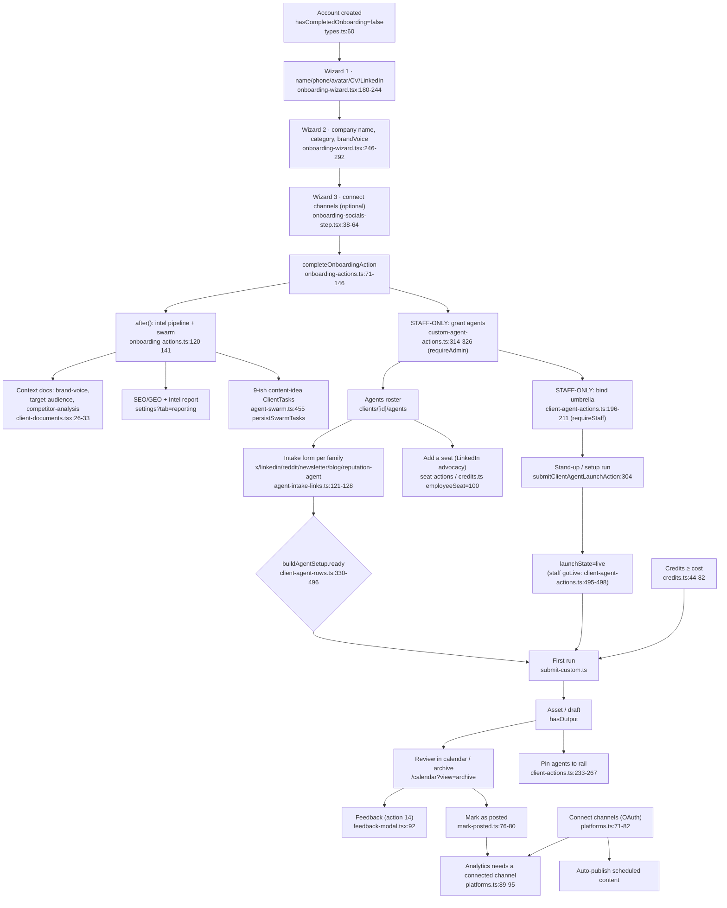

# Karos CMO — the client setup ladder

Audit of the fresh-account → full-capability journey, grounded in the worktree at
`.claude/worktrees/instagram-post-ordering-5c8eaa`. Read-only pass; nothing edited.
All paths are repo-relative; `file:line` is the evidence for each claim.

---

## 0. The three findings that govern everything below

**F1 — Home's "Recommended tasks" are not setup steps, and are not linked to agents by
construction.** The widget renders `ClientTask` rows with `status: "pending"`,
`owner: "karos_managed"`, `source: "copilot"` (`src/lib/recommended-tasks.ts:22`),
selected on Home at `src/app/(app)/clients/[id]/page.tsx:285`. Those rows are authored by
a 3-persona LLM debate (`src/lib/agent-swarm.ts:117` personas, `:314` `runSwarm`,
`:216` `finalizeConsensus`) fired once, fire-and-forget, at the end of onboarding
(`src/lib/actions/onboarding-actions.ts:120-141`). They are content ideas ranked by an
LLM `weight`, deduped by title (`:220-228`), capped at `MAX_ACTIVE_TASKS`. Their only
agent link is an optional `metadata.customAgentId`/`agentName` the model may or may not
set (`src/app/(app)/clients/[id]/page.tsx:286`, `resolveTaskCustomAgentId`), which is why
a task can land on `/clients/{id}/agents?task=…` — the roster, no agent — at
`src/app/(app)/clients/[id]/page.tsx:300`. Nothing in that pipeline knows or asks whether
the client has finished setting anything up.

**F2 — The real setup engine already exists, but it is 24 rows long, mixes prerequisites
with steady-state habits, and several of its "done" signals are things only Karos staff
can do.** `src/lib/action-list.ts:66-255` defines 24 rows across 6 categories;
`:309-330` computes done; Home resolves it at `src/app/(app)/clients/[id]/page.tsx:241-265`.
Row 03 ("Set up your first agent") is `done` when `client.customAgentIds` is non-empty
(`src/lib/action-list.ts:310`, signal at `page.tsx:243`) — but that array is only writable
by `setClientCustomAgentsAction`, which is `await requireAdmin()`
(`src/lib/actions/custom-agent-actions.ts:314-326`, gate at `:318`). A client cannot
complete their own step 3. Same for row 08 ("Set up your second agent",
`grantedAgentCount >= 2`, `action-list.ts:319`) and row 24 (billing — only an admin
grants credits, `src/components/credits-panel.tsx:309`).

**F3 — There is no stored per-client ordering.** `ACTION_DEFINITIONS` is a hand-typed
array and the top-3 selection is `.slice(0, 3)` over array order
(`src/lib/action-list.ts:372`). `Client` (`src/lib/types.ts:91-…`) has no field for a
ranked setup ladder. The onboarding swarm ranks *content ideas*, never setup steps
(`src/lib/agent-swarm.ts:577-689` `buildSwarmContext` assembles gap/brand/benchmark/
staleness/backlog prose only).

---

## 1. Capability map: everything a client can DO, and every prerequisite

### 1.1 Prerequisite vocabulary (the six gate kinds)

| Gate | Where enforced | Predicate |
|---|---|---|
| **Grant** | `submitCustomAgentJob` / launch action | `client.customAgentIds` contains agent id — `src/lib/types.ts:164`; check `src/lib/actions/client-agent-actions.ts:322-323` (`isCustomAgentGrantedToClient`) |
| **Umbrella live** | client run + schedule | `ClientAgent.launchState === "live"` — `src/lib/types.ts:3120-3130`; refusal `src/lib/client-agent-gate.ts:45-54`, ladder `src/lib/client-agent-runs.ts:53-65` |
| **Intake** | submit core, hard | `has*AgentIntake(clientId)` — `src/lib/jobs/submit-custom.ts:339, 368, 417, 442, 462, 482` |
| **Stand-up run** | submit core, hard | `has*V2Setup(clientId)` — `src/lib/jobs/submit-custom.ts:385, 447, 467, 487` |
| **Channel** | publish / analytics only | `integrationIsUsable(i)` = status not `expired`/`reauthenticate` — `src/lib/integration-status.ts:15-21` |
| **Credits** | charge before dispatch | `CREDIT_COSTS.customAgentRun = 25`, seat `= 100` — `src/lib/credits.ts:44-82`; defaults balance 200 / weekly 150 / monthly 400 — `src/lib/credits.ts:577-583` |

Note the asymmetry that matters for a setup checklist: **a connected channel is NOT a
prerequisite for any agent run.** No `submit-custom.ts` gate reads
`ClientIntegration`. Channels feed auto-publish, analytics, the swarm's gap prose
(`src/lib/agent-swarm.ts:596-602`) and the calendar's sparse banner
(`src/app/(app)/calendar/calendar-body.tsx:311-314`) — the drafts arrive either way.

### 1.2 Dependency graph



### 1.3 Every client-reachable capability, with its gates

| # | Capability | Where | Prerequisites (evidence) |
|---|---|---|---|
| C1 | Finish the signup wizard | `/onboarding` — `src/app/(onboarding)/onboarding/page.tsx:19-56` | account with `clientId`; blocked-in by `shouldBlockForOnboarding` `src/lib/onboarding.ts:19-23` |
| C2 | Fill company profile (category, team size, socials) | `settings?tab=profile` → `ClientProfilePanel` `src/components/client-profile-panel.tsx:507-528` | none |
| C3 | Fill description / website | same panel, `src/components/client-profile-panel.tsx:411-420` | none |
| C4 | Upload logo + brand colours | `BrandColorsSection` `src/app/(app)/clients/[id]/settings/page.tsx:357-362` | website helps (`hasWebsite`) |
| C5 | Read/annotate context docs | `settings?tab=profile#documents` `src/app/(app)/clients/[id]/settings/page.tsx:333-345, 401` | intel pipeline has run (fires at `onboarding-actions.ts:124-127`) |
| C6 | Add a competitor by hand | `settings?tab=competitors` — `src/lib/actions/competitor-actions.ts:366` (`source:"manual"` `:49,:72`) | none |
| C7 | Connect a channel (OAuth) | `settings?tab=settings` → `IntegrationsTab`; ids at `src/lib/integrations/platforms.ts:71-82` | platform enabled; TikTok blocked pending verification (`platforms.ts:113-120`) |
| C8 | See granted agents | `/clients/{id}/agents` `src/app/(app)/clients/[id]/agents/page.tsx:198-200` | **grant (admin)** |
| C9 | Fill an agent's intake | `/clients/{id}/{family}-agent` `src/lib/agent-intake-links.ts:150-152` | grant |
| C10 | Fire a run | agent detail page only ("no Run button" on roster — `agents/page.tsx:287-291`) | grant + intake + stand-up + umbrella-live (for umbrella agents) + credits |
| C11 | Fire a stand-up/setup run | launch card — `src/lib/actions/client-agent-actions.ts:304-340` | grant + umbrella bound by staff (`:196-211 requireStaff`) + intake + credits |
| C12 | Schedule an agent | agent detail | umbrella live — `src/lib/client-agent-gate.ts:45-54` |
| C13 | Review drafts / archive | `/calendar?view=archive` (`action-list.ts:104`) | an asset exists |
| C14 | Add context to an upcoming post | `/calendar` slot note — `src/components/run-calendar.tsx:498` | a future-dated asset |
| C15 | Send feedback on a post/agent | `src/components/client-agents/feedback-modal.tsx:73-95` | an agent + a delivered post |
| C16 | Mark as posted | `MarkPostedRow` (asset card, detail modal, calendar day) — rule `src/lib/mark-posted.ts:76-80` | approved asset whose day has arrived |
| C17 | Export a day of content | Calendar page download card — `src/components/client-downloads.tsx:64` | assets on that day |
| C18 | Pin agents to the rail | `src/lib/actions/client-actions.ts:233-267` | ≥1 granted agent |
| C19 | Add a teammate seat | seat pipeline (`addEmployeeSeatAction`, used at `onboarding-actions.ts:54`) | credits if over `linkedinSeatLimit` (`types.ts:177`, cost 100 `credits.ts:81`) |
| C20 | Read the SEO/GEO report | `settings?tab=reporting` (`page.tsx:234`, tabs `settings/page.tsx:828-832`) | pipeline has run |
| C21 | Turn SEO/GEO recs into tasks | `createTasksFromSeoGeoReportAction` `src/lib/actions/seo-geo-task-actions.ts:42-60` | a `seo-geo-agent` report asset exists |
| C22 | Run a dynamic-agent spec | `/clients/{id}/dynamic-agents` `src/app/(app)/clients/[id]/dynamic-agents/page.tsx:33-43` | spec `active` + `allowedClientIds` includes client (admin-controlled) |
| C23 | See credits / spend | `settings?tab=credits` `src/components/credits-panel.tsx:72-73` | none (grants are admin-only, `:309`) |
| C24 | Chat with the copilot | chatbot widget | credits (`chatMessage` `credits.ts:54`) |

---

## 2. The canonical setup ladder

Legend: **P** = prerequisite to first output (belongs in the recommended set);
**L** = later-value; **S** = staff-blocked (a client cannot complete it alone).

### 2.1 Tier 0 — before the portal (already handled by the wizard)

| id | Label | Why | Where | Completion signal today | Class |
|---|---|---|---|---|---|
| `s0.name` | Tell us who you are | Powers the voice used in drafts | `/onboarding` step 1 | `AppUser.name` set; `saveOnboardingProfileAction` `src/lib/actions/onboarding-actions.ts:21-38` | P (done by construction) |
| `s0.company` | Name your company + industry | The one field every prompt reads | `/onboarding` step 2 | `client.category` (`types.ts:116`), written clamped at `onboarding-actions.ts:104-109` | P |
| `s0.voice` | Describe your brand voice | Seeds every draft | `/onboarding` step 2 | `client.brandVoice` (`types.ts:128`) — **written once here (`onboarding-actions.ts:108`) and never read by the checklist**; `action-list.ts:277-278` explicitly calls it dead | P |
| `s0.done` | Finish setup | Fires intel + swarm | `/onboarding` step 3 | `AppUser.hasCompletedOnboarding === true` — `src/lib/onboarding.ts:9-11` | P |

### 2.2 Tier 1 — PREREQUISITES TO FIRST OUTPUT (the recommended-tasks set)

These are the only rows that stand between "account created" and "a draft exists".

| id | Label (imperative) | Why (one line) | Href | Completion signal (field/predicate, file:line) | Existing action id | Engine gap |
|---|---|---|---|---|---|---|
| `P1` | Complete your company profile | Every agent writes from your category and description | `/clients/{id}/settings?tab=profile` | `Boolean(client.description?.trim() && client.category?.trim())` — `src/app/(app)/clients/[id]/page.tsx:242` | **01** | none — this one is honest |
| `P2` | Confirm your brand voice & audience | The two docs every draft is graded against | `/clients/{id}/settings?tab=profile#documents` | event row only: `markActionDoneAction(clientId,"21"/"22")` on doc open — `src/components/client-documents.tsx:862-864, 1003-1005` | **21**, **22** | two rows for one gesture; and the docs may not exist yet (pipeline is fire-and-forget, `onboarding-actions.ts:120`) — no signal distinguishes "not generated" from "not opened" |
| `P3` | Set up your first agent's details | The agent cannot draft without its intake form | `/clients/{id}/{family}-agent` via `intakePageHref` — `src/lib/agent-intake-links.ts:150-152` | `buildAgentSetup(...).ready` per agent — `src/lib/client-agent-rows.ts:330-496` (X `:338`, LinkedIn `:360-368`, Reddit `:383`, newsletter `:405-408`, blog `:439-442`, reputation `:460-463`) | **none** | **This is the single biggest gap.** The checklist has no row for "your intake is missing", although it is the hard gate the server refuses on (`submit-custom.ts:339…487`). Action 03 pretends to cover it but measures an admin grant instead. |
| `P4` | Run your first agent | Nothing exists until one run finishes | `/clients/{id}/agents/{agentId}` (run gesture lives only there — `agents/page.tsx:287-291`) | `jobs.length > 0` — `page.tsx:245` | **04** | signal counts ANY job including staff-fired and failed ones; no "succeeded" clause |
| `P5` | See your first result | Closes the loop; proves the product | `/calendar?view=archive` — `action-list.ts:104` | `assets.length > 0` — `page.tsx:247` (documented proxy, `action-list.ts:292-294`) | **05** | proxy only: nothing records the client opening an output |
| `S1` | *(staff)* Grant the agents on the plan | The roster is empty until Karos grants | admin: client settings | `client.customAgentIds?.length > 0` — `page.tsx:243` | **03**, **08**, **09** | **must not be a client-facing checklist row** — `requireAdmin`, `custom-agent-actions.ts:318` |
| `S2` | *(staff)* Bind + go live on umbrella agents | Template/calendar agents refuse client runs until live | admin | `ClientAgent.launchState === "live"` — `types.ts:3120-3130`; refusal `client-agent-gate.ts:45-54` | none | same — staff-only (`client-agent-actions.ts:211, 498`) |

**So the honest, client-completable prerequisite set is five rows: P1, P2, P3, P4, P5.**
That is exactly the "5 steps" the product owner asked for, and each is genuinely blocking.

### 2.3 Tier 2 — later value (steady state; NOT recommended tasks)

| id | Label | Why | Href | Signal | Existing id | Gap |
|---|---|---|---|---|---|---|
| `L1` | Connect the channels you post to | Auto-publish + real analytics instead of estimates | `settings?tab=settings` | `connectedPlatformIds.includes(<id>)` — `action-list.ts:323-327`, source `page.tsx:252` | **16-20** (+10) | five near-identical rows; should collapse to one "Connect your channels · 2 of 5" row. Note ids 16-20 target `tab=settings` while 10 targets `tab=profile` — two different "channels" concepts (`action-list.ts:185-191`) |
| `L2` | Review your competitors | Sharpens positioning in every draft | `settings?tab=competitors` | `competitors.some(c => c.source === "manual")` — `page.tsx:249` | **07**, **23** | 07 and 23 are the same subject with two signals (live vs event row) |
| `L3` | Look at your week | The calendar is where work lands | `/calendar` | event row, `run-calendar.tsx:1676` | **12** | fine |
| `L4` | Add context to an upcoming post | Steers a draft before it is written | `/calendar` | event row, `run-calendar.tsx:498` | **13** | fine |
| `L5` | Tell an agent what to change | Feedback is the only correction channel | agent page → feedback modal | event row, `feedback-modal.tsx:92` | **14** | fine |
| `L6` | Mark a post as posted | Keeps the calendar and analytics truthful | calendar / asset card | `asset.status === "published"`; rule `mark-posted.ts:76-80` | **none** | **missing entirely**, though the product owner names it as steady state |
| `L7` | Pin the agents you use most | Fast access in the rail | `/clients/{id}/agents` | `client.starredAgentIds?.length > 0` — `page.tsx:248`; writer `client-actions.ts:233-267` | **06** | fine |
| `L8` | Add a teammate | Advocacy seats, shared review | `/clients/{id}/agents` (href) | `seats.length >= 2` — `page.tsx:251` | **11** | href points at the agents roster; seats are edited on the *agent's* setup page and listed under `settings?tab=profile` (`settings/page.tsx:363-395`) — wrong destination |
| `L9` | Export a day of content | Hand-off to whoever posts | `/calendar` | event row, `client-downloads.tsx:64` | **15** | fine |
| `L10` | Read your visibility report | Where you stand in search + AI answers | `settings?tab=reporting` | none | **none** | not represented |
| `L11` | Confirm credits & billing | Know what a run costs | `settings?tab=credits` | deviation from `CREDIT_DEFAULTS` — `page.tsx:256-259` | **24** | **client cannot complete it** — only an admin grants (`credits-panel.tsx:309`) |

### 2.4 What the existing engine is missing, in one list

1. No intake row (`P3`) — the actual hard gate is invisible to the checklist.
2. Three rows (03/08/24, plus 09's derivation) are completable only by staff.
3. No mark-posted row, no report row.
4. Five separate "Connect X" rows inflate the list to 24 and produce the "See all 24" UI.
5. No per-client ordering; `slice(0,3)` over a hand-typed array (`action-list.ts:372`).
6. No progress concept: `shouldStartExpanded` (`:387`) is the only aggregate, and it is a
   boolean about prominence, not progress.
7. Duplicate subjects: 07↔23 (competitors), 10↔16-20 (channels), 02↔03 (same signal,
   `action-list.ts:310`).

---

## 3. Per-agent "first result" sub-ladders

Six families have a portal intake page (`src/lib/agent-intake-links.ts:118-128`); the
Instagram/karos content engine does not — it is an umbrella/template agent.

### 3.1 Instagram / karos content (`karos-instagram-tiktok-content-agent`)
- Archetype `template_calendar` — `src/lib/agent-archetype.ts:42, 55-60` (explicitly NOT a
  clip maker).
- Before first run: grant (admin) → umbrella bound (staff, `client-agent-actions.ts:196-211`)
  → setup/launch run fired (`:304`, client may fire it if granted, `:322-323`) →
  staff curate templates (`:472-476`) → `goLiveClientAgentAction` (`:495-498`) →
  `launchState === "live"`.
- Client-side prerequisites: **credits only** (25/run, `credits.ts:73`). No intake form,
  no channel.
- After: the week strip shows planned slots; the client reviews on `/calendar`, adds slot
  context (`run-calendar.tsx:498`), marks posted (`mark-posted.ts:76-80`), sends feedback
  (`feedback-modal.tsx:92`).
- Client-visible blockers read as "Not set up yet" on the roster
  (`agents/page.tsx:287-296`) with **no self-service path** — this is the family where a
  checklist row would lie hardest if worded as a client action.

### 3.2 X (e13, `docs/x-agent-portal.md`)
- Gate: `hasXAgentIntake(clientId)` — `submit-custom.ts:339`; setup state
  `client-agent-rows.ts:337-348` (`standUpDone: true` — "No stand-up run exists for X").
- Ladder: grant → `/clients/{id}/x-agent` company-page form → Run → draft.
- After: review draft, feedback, post by hand, mark posted.

### 3.3 LinkedIn (e10)
- **Two gates.** `hasLinkedInAgentIntake(clientId, agentKey)` (`submit-custom.ts:368`) and,
  for v2 writers, `hasLinkedInV2Setup(clientId)` (`:385`); per-seat voice profile is a
  third refusal (`:392`). Resolved together at `client-agent-rows.ts:360-368`.
- Ladder: grant → LinkedIn agent details form → "Set it up" stand-up run (builds lanes,
  voice, first topics) → per-seat "Build their voice" for advocacy → Run → draft.
- Seats: `addEmployeeSeatAction`; the wizard already creates the signer's own seat
  (`onboarding-actions.ts:45-65`).
- Only family whose stand-up can be outstanding at run time — the stand-up refusal text is
  LinkedIn-specific by construction (`src/lib/client-agent-runs.ts:80-91`).

### 3.4 Reddit (e15)
- Gate: `hasRedditAgentIntake` — `submit-custom.ts:417`; state `client-agent-rows.ts:379-393`.
- Draft-only by hard product rule (CLAUDE.md); one run drafts ONE reply.
- Ladder: grant → `/clients/{id}/reddit-agent` account form → Run → one reply draft →
  a human posts it from their own account → (no mark-posted path for a Reddit reply).

### 3.5 Blog
- **Both rungs folded into `ready`**: `hasBlogAgentIntake` + `hasBlogV2Setup` —
  `submit-custom.ts:462, 467`; `client-agent-rows.ts:439-452`.
- Reason stated in code: the writer claims a post number at step 01, so a run without setup
  is charged and dies (`client-agent-rows.ts:435-438`).
- Ladder: grant → blog details (own domains, off-limits subjects) → "Set it up" (voice,
  cluster map, numbering) → Run → article.

### 3.6 Newsletter
- Both rungs, same shape: `hasNewsletterAgentIntake` + `hasNewsletterV2Setup` —
  `submit-custom.ts:442, 447`; `client-agent-rows.ts:405-431`.
- Intake asks send day + compliance limits (`submit-custom.ts:444`).
- Ladder: grant → newsletter details → "Set it up" (voice, topic list, issue numbering) →
  Run → issue draft.

### 3.7 Reputation
- Both rungs: `hasReputationAgentIntake` + `hasReputationV2Setup` —
  `submit-custom.ts:482, 487`; `client-agent-rows.ts:460-485`.
- Intake asks who hears about an urgent review (`submit-custom.ts:484`); setup finds real
  listings and defines "urgent" (`:489`).
- Ladder: grant → reputation details → "Set it up" → pulse run → review drafts.

### 3.8 Landing page (managed product)
- `MANAGED_PRODUCTS` now holds exactly two entries: `social_post` and `landing_page` —
  `src/lib/agent-service/products.ts:137-184`.
- No intake family; dispatched from a task/brief. Prerequisite is credits + a brief.

### 3.9 Dynamic agents (Studio)
- Availability: `spec.active && (allowedClientIds empty || includes client)` —
  `src/app/(app)/clients/[id]/dynamic-agents/page.tsx:35-43`. Admin-controlled.
- Before first run: admin authored + activated the spec; client fills the spec's input
  schema; credits.
- Guardrails ride on top and can BLOCK a finished run (`Client.forbiddenTopics`,
  `types.ts:291`; behaviour per `docs/dynamic-agent-guardrails.md`).

---

## 4. Ordering at onboarding

### 4.1 Signals available the moment `completeOnboardingAction` runs

Read straight off the transaction and the wizard input:

| Signal | Source |
|---|---|
| `client.category` (industry/niche) | `onboarding-actions.ts:104-109`; field `types.ts:116` |
| `client.name`, `client.brandVoice` | `onboarding-actions.ts:105-109` |
| `client.website` | `types.ts:94` (staff-set or profile panel) |
| `client.socialLinks` | `types.ts:122` — which handles the client actually has |
| Connected integrations | wizard step 3 → `listClientIntegrations` (`onboarding/page.tsx:29-32`) |
| Granted agents `customAgentIds` | `types.ts:164` — set by admin, usually before signup |
| Seat created for the signer | `ensureOwnEmployeeSeatAction` `onboarding-actions.ts:45-65` |
| LinkedIn connected for the signer | `user.linkedInConnected` (`onboarding-wizard.tsx:89`) |
| Everything `buildSwarmContext` gathers | `agent-swarm.ts:577-689`: gap prose (`:596-602`), branding (`:604-614`), benchmarks (`:631-641`), staleness (`:669-675`), review backlog (`:676`), custom agents (`:586`) |

Note `buildSwarmContext` already receives `customAgents: ClientCustomAgentSummary[]`
(`:171, :586`) — the exact list a per-client ladder needs to rank.

### 4.2 Proposal — deterministic first, LLM second

**Step A (pure, deterministic, always runs).** Build the candidate ladder from data, not
from a hand-typed array:

1. Always include, in this order, the rows that are true prerequisites and
   client-completable: `P1` profile → `P2` brand voice & audience → then one **`P3.<agent>`
   row per granted agent that has an intake family** (`buildAgentSetup` gives exactly this
   set and its `ready`/`href`/`clientLabel` — `client-agent-rows.ts:330-496`) → `P4` first
   run → `P5` first result.
2. Drop any row whose signal is already true (endowed progress, §6).
3. Drop every staff-only row (`S1`, `S2`, credits) from the client list entirely; surface
   those as a "Karos is finishing your setup" line, not a task.
4. Cap the visible ladder at **5 steps** (§6). Collapse the per-agent rows to the top 2
   agents and fold the rest into `P4`'s "…and the rest of your agents".

**Step B (ranking, deterministic rules first).** Order the `P3.<agent>` rows by a score:

| Rule | Weight | Evidence available |
|---|---|---|
| The client already has a handle on that platform (`socialLinks.instagram` set → Instagram agent first) | +40 | `types.ts:122` |
| That platform is connected as a usable integration | +30 | `integrationIsUsable`, `integration-status.ts:20` |
| The agent is `starredAgentIds`-pinned (Karos pinned it at onboarding) | +25 | `types.ts:164-171` |
| Category keyword match (a table: "b2b saas"/"agency" → LinkedIn, X; "restaurant"/"local"/"clinic" → reputation, Instagram; "ecommerce"/"dtc" → Instagram, newsletter; "media"/"publisher" → blog, newsletter) | +20 | `client.category` |
| Cheapest time-to-first-output (no stand-up run required: X, Reddit) | +10 | `client-agent-rows.ts:342, 387` ("No stand-up run exists") |
| Agent needs a stand-up run before any output | −10 | LinkedIn/blog/newsletter/reputation gates |

Ties break by `customAgentIds` order (the plan's own order).

**Step C (optional LLM refinement, one call, cheap).** Only when a deterministic score tie
spans >2 agents or `category` matched nothing. Prompt: client name + category + brandVoice
+ website + socialLinks + the granted agent names/descriptions (`ClientCustomAgentSummary`
already carries `name`/`description`, `agent-swarm.ts:246`), asking for a permutation of
the agent ids ONLY — never new steps, never free text. Validate the response is a
permutation of the input ids; on any failure keep Step B's order. Bill it like the swarm
does (`agent-swarm.ts:291-301`) and run it inside the same `after()` block that already
holds the AI-processing lock (`onboarding-actions.ts:120-141`), so it costs no extra
latency and cannot race a Regenerate.

**Step D — where to store it.** Add to `Client` (`src/lib/types.ts:91-…`), beside
`starredAgentIds`:

```ts
/** Ordered setup-ladder step ids for this client, decided once at onboarding.
 *  Absent ⇒ the default order in lib/setup-ladder.ts. Ids only — labels, hrefs
 *  and completion signals stay in code, so a stored order can never resurrect a
 *  step that no longer exists. */
setupLadderOrder?: string[];
/** When it was computed, so a re-grant can trigger a recompute. */
setupLadderOrderAt?: number;
```

Ids only, deliberately: the same discipline `action-list.ts` uses for
`ClientActionState.actionId` (`types.ts:2079`) — a stored label would go stale, a stored
id resolves through code or is ignored.

**Step E — how Home reads it.** `resolveSetupLadder(signals, states, client.setupLadderOrder)`
replaces the `resolveActionList` + `slice(0,3)` pair at
`src/app/(app)/clients/[id]/page.tsx:264-265, 574-576`. Unknown ids in the stored array are
dropped; known ids missing from it are appended in default order. Home renders one widget
(§6) instead of two.

**Default order when no ranking exists** (legacy clients, failed LLM call, no category):

1. Complete your company profile
2. Confirm your brand voice and audience
3. Set up your first agent's details *(first granted agent with an intake family, in
   `customAgentIds` order; if none has an intake family, this row is skipped)*
4. Run your first agent
5. See your first result

That is a strict subset of today's semantics, so it can ship without a
`ClientActionState` migration: reuse ids `01`, `21`+`22`, a new `25`, `04`, `05`.

---

## 5. What to do with the swarm's content-idea tasks

**Where they live today.**
- Written by `persistSwarmTasks` (`agent-swarm.ts:455`) as `karos_managed`/`copilot`
  `ClientTask`s (owner/source types `types.ts:2276-2289`).
- Surface 1 — Home's "Recommended tasks" (`page.tsx:285-302`, widget
  `src/components/home-recommended-tasks.tsx:61-118`).
- Surface 2 — the Calendar's review cards, one per inferred day
  (`calendar-body.tsx:315-350`, placement `inferSuggestionDates`).
- Surface 3 — the Calendar's sparse banner, which counts them
  (`calendar-sparse-banner.tsx:68-80`) and offers "Generate more"
  (`RefreshTaskMapButton`, mounted in every branch, `:25-35`).
- Surface 4 — the kickoff strip on an agent page when `?task=` names one
  (`task-kickoff.ts:38-63`, `task-kickoff-strip.tsx:53-78`).

**Recommendation — keep the feature, take it off Home.**

1. **Remove the `RecommendedTasksWidget` mount from Home**
   (`page.tsx:446-447`, rendered at `:565` and `:691`). Home's single list becomes the
   setup ladder (§6). Delete nothing else.
2. **Keep `isRecommendedTask` and the widget component** — the Calendar page is the right
   home for "ideas for what to post next", and it already renders them with dates
   (`calendar-body.tsx:332-350`). Rename the Calendar's own framing to
   **"Content ideas"** so the word "recommended" belongs to the setup ladder alone.
3. **Keep the kickoff strip and the `?task=` deep link** (`task-kickoff.ts:46`) — it is the
   one place a content idea correctly becomes an agent run, and it already refuses
   anything that is not this client's pending copilot task.
4. **Keep "Generate more" on the Calendar** (`calendar-sparse-banner.tsx:25-35`) — the
   product owner's earlier ruling removed it from Home, not from the product.
5. **Do not delete the swarm.** Its output remains the calendar's idea supply and the
   task-map source; the change is purely *which surface* shows it.
6. Optional follow-up that satisfies "everything must be linked to our agents": tighten
   `persistSwarmTasks` so a task with no resolvable `customAgentId`/`productType` is
   dropped rather than persisted — today `taskExecutorLabel` falls back to the generic
   "Karos AI" (`recommended-tasks.ts:37`), which is exactly the unlinked row the ruling
   objects to.

---

## 6. Checklist UX — how the widget should look

### 6.1 What the evidence says

| Question | Ruling | Source |
|---|---|---|
| **How many steps** | **5 visible, hard cap 7.** Chameleon's own data: *"Users are likely to complete ~5 items from a checklist, so be selective in what to include"*. Product-onboarding guidance converges on "the 3-5 key actions to reach the 'Aha' moment". | [Chameleon · Checklists](https://www.chameleon.io/patterns/checklists), [Userpilot · onboarding checklist](https://userpilot.com/blog/user-onboarding-checklist-tips/) |
| **Progress indicator** | **A bar plus an explicit count.** NN/g: when a percentage is uncertain, *"Instead of showing a percentage number, consider showing the number of steps."* Chameleon names *"a progress indicator bar"*. Use `▓▓▓░░ 3 of 5`. | [NN/g · Progress Indicators](https://www.nngroup.com/articles/progress-indicators/), [Chameleon](https://www.chameleon.io/patterns/checklists) |
| **Do completed steps stay visible** | **Yes — checked and de-emphasised, until the whole list is done.** GOV.UK: *"Once the user has completed the task, the status should show as 'Completed' and be black text with no background colour. This will draw more attention to tasks that require action."* Material keeps completed steps visible and (where useful) editable. | [GOV.UK · Complete multiple tasks](https://design-system.service.gov.uk/patterns/complete-multiple-tasks/), [Material · Steppers](https://m1.material.io/components/steppers.html) |
| **Endowed progress** | **Pre-tick the wizard.** Nunes & Drèze: 8-stamp card = 19% completion; 10-stamp card with 2 pre-stamped = **34%**. Coglode's rule: *"aim for between 10-25% of the total effort required."* One pre-ticked step out of six is 17%. | [Coglode · Endowed progress](https://www.coglode.com/nuggets/endowed-progress-effect), [Nunes & Drèze, SSRN 991962](https://papers.ssrn.com/sol3/papers.cfm?abstract_id=991962) |
| **On completion** | **Show a brief "You're set up" state, then let it be dismissed and disappear.** Chameleon supports "Hide when complete" per item and an *Empty State* shown once every item is done. | [Chameleon Help · events to check or hide items](https://help.chameleon.io/en/articles/3700082-using-events-to-check-or-hide-items) |
| **Auto vs manual completion** | **Auto, from product signals.** Chameleon: *"Mark items completed based on user activity within the app rather than just by clicking or starting the items."* | [Chameleon · Checklists](https://www.chameleon.io/patterns/checklists) |
| **Ordering** | **Value order, easy first, and free order where possible.** Appcues: *"Organize the checklist items in a logical order that mirrors the user's journey"*, starting with *"foundational tasks"*. GOV.UK: *"Where possible, allow users to complete tasks in any order."* Chameleon: make the first item easy, and *"articulate the benefit or value of the items included."* | [Appcues · checklist examples](https://www.appcues.com/blog/best-checklist-examples), [GOV.UK](https://design-system.service.gov.uk/patterns/complete-multiple-tasks/) |
| **Grouping when long** | GOV.UK: *"If there are lots of tasks to complete, you might also need to group them further into steps."* Our answer is not to group 24 rows — it is to have 6. | [GOV.UK](https://design-system.service.gov.uk/patterns/complete-multiple-tasks/) |

### 6.2 The rulings, applied to Karos

1. **One widget, not two.** "Next actions" (`home-action-list.tsx:45`) and "Recommended
   tasks" (`home-recommended-tasks.tsx:61`) merge into **"Get set up"**. Content ideas move
   to the Calendar (§5).
2. **Six steps, one pre-ticked.** Step 0 "Create your workspace" ships checked (the wizard
   is genuinely done — `hasCompletedOnboarding`, `onboarding.ts:9-11`), then the five of
   §2.2. That is 1-of-6 = 17% endowed progress, inside the 10–25% band.
3. **Delete "See all 24".** Nothing is hidden behind an expander, so
   `shouldStartExpanded` (`action-list.ts:387`) and the expand toggle
   (`home-action-list.tsx:104-112`) both go away.
4. **Everything auto-completes** from the signals already computed at
   `page.tsx:241-260`. Manual ticks stay only where no signal exists (the doc-open rows,
   `client-documents.tsx:1003-1005`) — and even those should ideally become
   "a doc exists AND was opened".
5. **The X is rare.** Only genuinely optional steps get "Not for us". Of the six, none is
   optional — so **the setup widget carries no X at all**, and
   `markActionNotRelevantAction` keeps serving only the later-value list (see 8 below).
6. **Completion state.** At 6 of 6: replace the rows with a single line —
   *"You're set up. Your agents are running."* — plus a "Got it" that writes one
   `ClientActionState` row (`upsertClientActionState`, `action-list-actions.ts:78`) with a
   reserved id, after which the widget returns `null` forever.
7. **Order comes from `client.setupLadderOrder`** (§4), with the default order as the
   fallback. Steps stay clickable in any order (GOV.UK) — nothing about the ladder is
   linear except the natural data dependency, and P4 simply says "your intake is missing"
   when pressed early (the sentence already exists:
   `client-agent-runs.ts:169`, *"{label} are missing. This agent needs them before it can
   make a post."*).
8. **The 18 later-value rows do not disappear** — they move to a secondary, collapsed
   "More ways to get value" list that only renders once the setup ladder is complete
   (Chameleon's "secondary checklist once items are completed"). Same
   `HomeTaskRow`, same X, same undo window (`home-task-row.tsx:21, 69`).

### 6.3 Visual spec (one widget)

```
┌──────────────────────────────────────────────────────────────┐
│ Get set up                                        3 of 6  ▸  │   ← CardTitle + count, mono 10px like today
│ ▓▓▓▓▓▓▓▓▓▓▓▓░░░░░░░░░░░░░░░░░░░░░░░░░░░░░░░░░░░░░░  50%      │   ← 4px bar, bg-surface-3, fill bg-neon, animated width
├──────────────────────────────────────────────────────────────┤
│ ✓  Create your workspace                                     │   ← done: Check icon, muted text, no controls
│ ✓  Complete your company profile                             │
│ ✓  Confirm your brand voice and audience                     │
│ ○  Set up your Instagram agent's details          [Let's do this] │ ← next: full contrast, icon chip, primary button
│      It cannot draft a post until it has them.               │   ← one-line why, text-muted-2, only on the NEXT step
│ ○  Run your first agent                                      │   ← future: muted, no button
│ ○  See your first result                                     │
└──────────────────────────────────────────────────────────────┘
```

Rules baked into the sketch:
- **Only the next incomplete step carries the button and the "why" line.** Future steps are
  listed (so the client can see the whole shape — GOV.UK) but not competing for the press.
  This is the one deviation from "any order": the affordance is ordered, the links are not
  (every row stays clickable).
- Done rows: `Check` glyph + `muted` (the treatment `home-action-list.tsx:131-133` already
  has), no trailing controls — GOV.UK's "no background colour, draws attention to what is
  left".
- Bar and count are computed from the same resolved array, so they cannot disagree.
- The row shell is unchanged (`ROW_BASE`, `home-task-row.tsx:11-12`), so this is a
  composition change, not a new design language.
- Completed state replaces the entire card body; the card itself unmounts after "Got it".

---

## 7. Concrete change list (if this is built)

1. New `src/lib/setup-ladder.ts` — 6 pure step definitions + `resolveSetupLadder()` +
   `ladderProgress()`. Reuses `ActionSignals` (`action-list.ts:49-64`) plus one new signal:
   `agentSetupReadyCount` / `agentSetupTotal` from `buildAgentSetup`
   (`client-agent-rows.ts:330`).
2. `Client.setupLadderOrder` + `setupLadderOrderAt` (`types.ts`, beside `starredAgentIds:171`).
3. `completeOnboardingAction` (`onboarding-actions.ts:120-141`) writes the order inside the
   existing `after()` block, after `buildSwarmContext` (which already has the agent list).
4. Home (`page.tsx:446-447, 565, 574-576, 691-695`): mount one `SetupLadderWidget`; move
   `ActionListWidget` behind "More ways to get value", gated on ladder completion; drop
   `RecommendedTasksWidget`.
5. Keep `action-list.ts`, `ClientActionState` and all 24 ids intact — the ladder reuses
   ids `01`/`21`/`22`/`04`/`05` plus one new id, so no migration and no lost dismissals.

---

## Sources

- [GOV.UK Design System · Complete multiple tasks](https://design-system.service.gov.uk/patterns/complete-multiple-tasks/)
- [NN/g · Progress Indicators Make a Slow System Less Insufferable](https://www.nngroup.com/articles/progress-indicators/)
- [Chameleon · Checklists pattern](https://www.chameleon.io/patterns/checklists)
- [Chameleon Help · Using events to check or hide items](https://help.chameleon.io/en/articles/3700082-using-events-to-check-or-hide-items)
- [Userpilot · How to create a user onboarding checklist](https://userpilot.com/blog/user-onboarding-checklist-tips/)
- [Appcues · User onboarding checklists: 6 examples](https://www.appcues.com/blog/best-checklist-examples)
- [Coglode · Endowed Progress Effect](https://www.coglode.com/nuggets/endowed-progress-effect)
- [Nunes & Drèze · The Endowed Progress Effect (SSRN 991962)](https://papers.ssrn.com/sol3/papers.cfm?abstract_id=991962)
- [Material Design · Steppers](https://m1.material.io/components/steppers.html)
